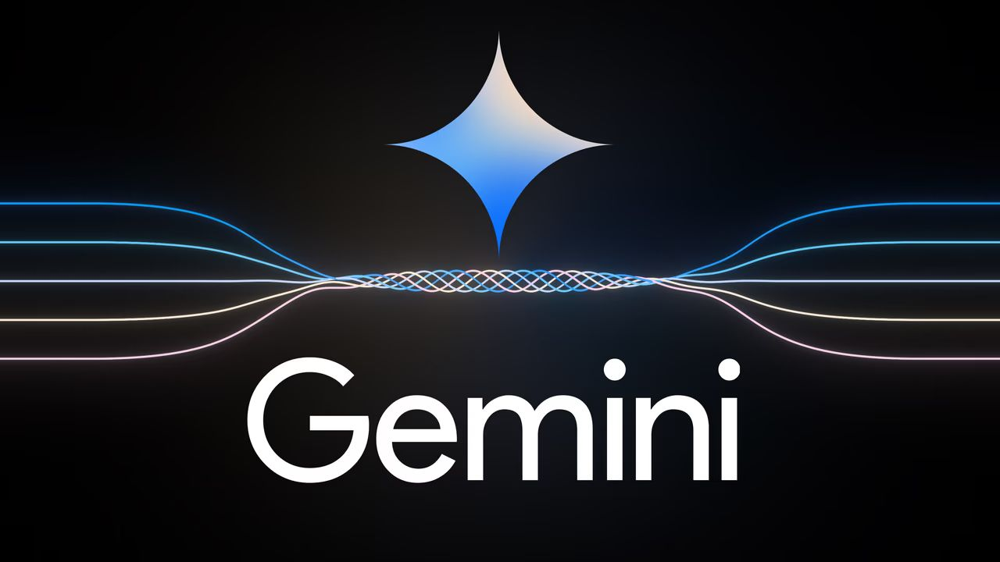
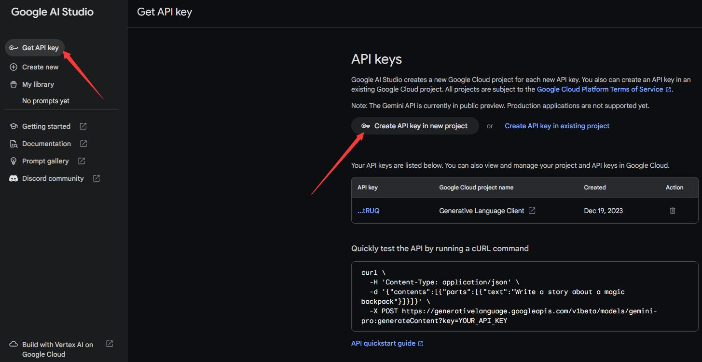
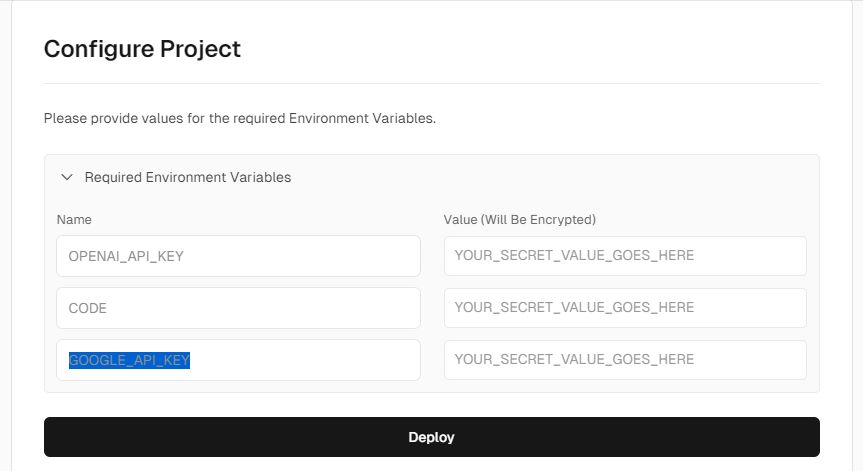

# 谷歌 Gemini 本地一键部署教程，媲美 GPT4，免费调用API key

 
谷歌最近正式开放了Gemini模型的 API，只要你拥有一个Google账号和一个海外 IP，你就可以免费申请使用Gemini Pro和Gemini Pro Vision，有关功能居然能媲美GPT-4！下面介绍API获取使用方法

## 关于Gemini

Gemini作为一种多模态模型，不仅能够理解文本，还能够无缝地解析图像、视频和音频。其能力甚至扩展到数学、物理和编码等领域，执行复杂任务。

32K 的上下文窗口
Google AI Studio可以快速构建应用
支持全球 180 多个国家和地区的 38 种语言
Gemini Pro 提供了多种 SDK，包括 Python、Android (Kotlin)、Node.js、Swift 和 JavaScript
每分钟请求&nbsp;60&nbsp;次
Gemini的不同版本旨在满足不同的计算需求，共分为三个尺寸：Nano、Pro和Ultra。

Gemini Nano：专为智能手机设计，特别适用于Google Pixel8。该模型能有效处理设备上的任务，如在聊天应用程序中提供建议回复或在不依赖外部服务器的情况下总结文本。

Gemini Pro：运行于谷歌的数据中心，驱动着谷歌AI聊天机器人Bard的最新版本。其在提供快速响应和理解复杂查询方面表现卓越。

Gemini Ultra：虽尚未广泛推出，但被定位为谷歌最强大的模型。在32个广泛使用的学术基准中，其在30个基准中表现卓越。设计用于执行高度复杂的任务，当前处于测试阶段，预计完成测试后将发布。

## Bard使用

目前谷歌Bard【https://bard.google.com/】已经支持Gemini Pro模型，解锁步骤如下：

1.更改Google账户默认语言为“英文”（这其实是让你获得Gemini模型的使用权限） Google账户语言设置地址：https://myaccount.google.com/language
2.回到Bard首页，在对话界面输入以下Prompt： If ask a question in Chinese, you will translate it to English, understand the meaning, and then generate a response in English. Finally, you will translate the answer back to Chinese and present it to me. 至此，我们已经解锁中文成功！

## API调用 {#api}

1.申请自己的API Key 点击链接： https://makersuite.google.com/app/apikey

登录自己的Google账号，依次点击Get API key - Creat API key in project，即可创建一个免费的Gemini API key

2.部署开源项目 ChatGPT-Next-Web 项目地址：【链接直达】

3.两种部署形式：

通过 Vercel 平台进行一键部署，完全免费！
如果是自己用，想更稳定，建议通过VPS部署，美国 IP 服务器会最稳定！
Docker 一键部署，先安装Docker环境

## Vercel部署

打开项目地址，点击Deploy 选择GitHub 再点击Create

CODE相当于访问密码，GOOGLE_API_KEY 这里填入我们前面获得的 API key

最后点击Deploy开始部署，稍等片刻就可以部署成功

点击打开部署得到的域名，填入刚才的访问密码就可以开始使用了

如果你都不想折腾，直接用这个部署好的就可以了 ai.hdgsb.com，并且还支持GPT4、Midjourney、文心一言等多种模型，真的非常强大和实用，