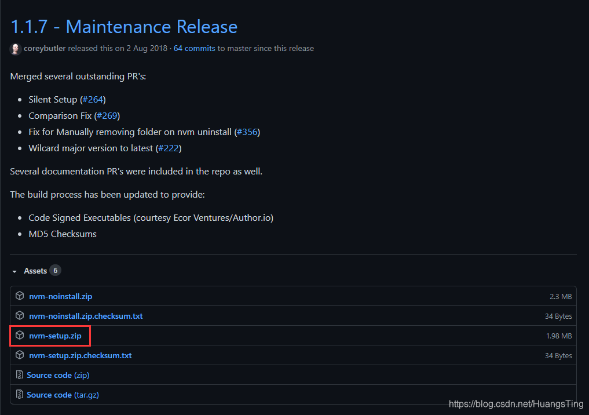
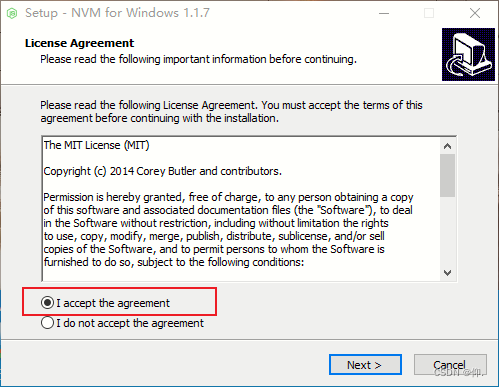
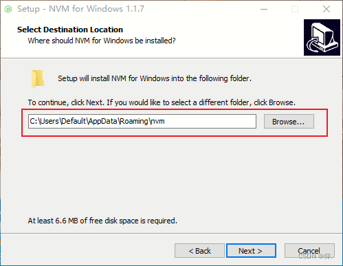
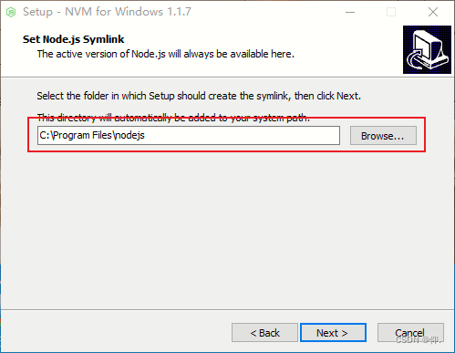
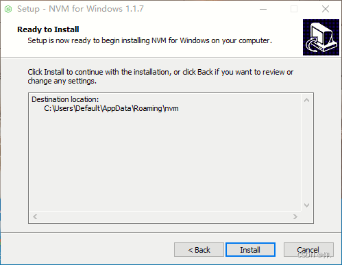
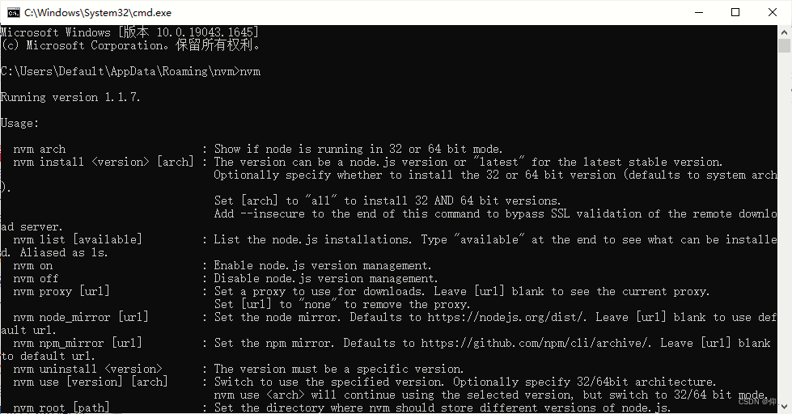
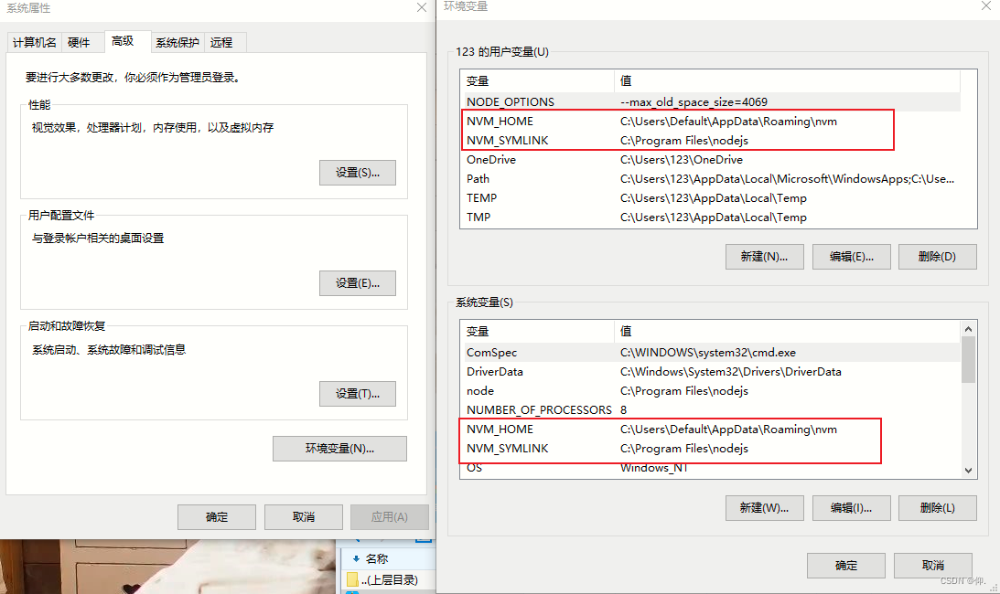
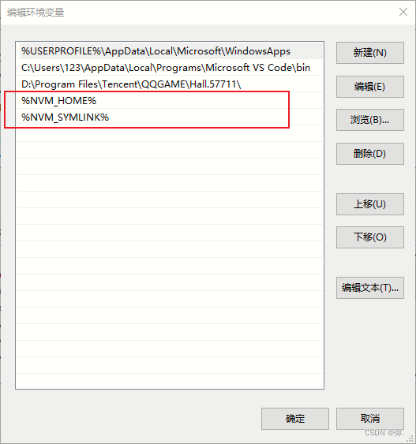
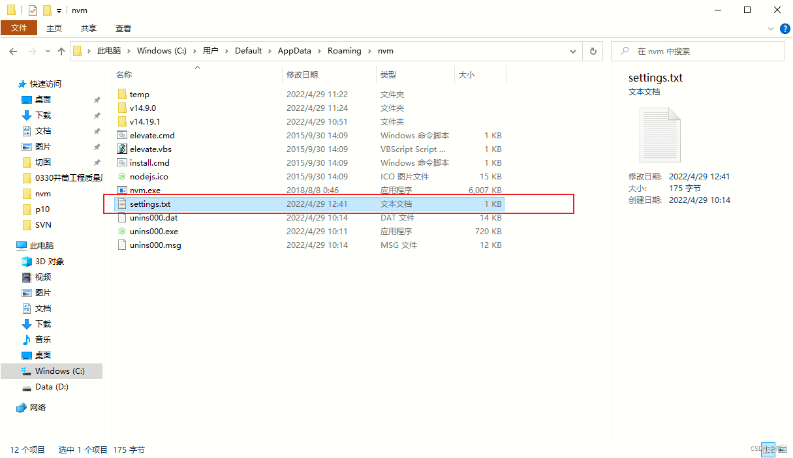
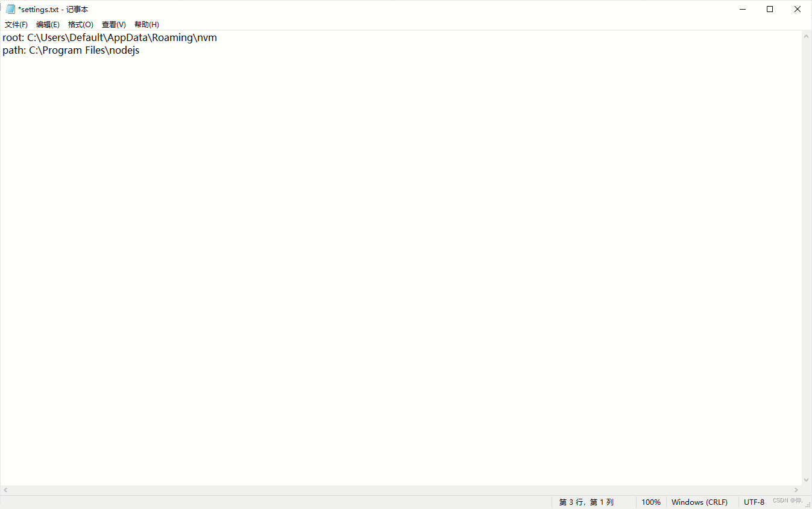

# nvm的简介、安装、使用

## 一、nvm是什么？

nvm是一个node的版本管理工具，可以简单操作node版本的切换、安装、查看 等等，与npm不同的是，npm是依赖包的管理工具。

## 二、nvm的安装

### 1. 去github [下载最新的 nvm](https://github.com/coreybutler/nvm-windows/releases) 找到 nvm-setup.zip 点击下载



### 2. 进行安装



（注意这里：默认安装到C盘，之后就不用配置环境变量了）





之后finish就完成安装了。完成可以以下方式检测



如果安装到D盘，则需要配置相对应的环境，如图：（输入相对应的文件位置）




### 3. 配置

找到nvm文件位置，点开setting




然后在它后面输入以下代码：（这是配置镜像源）

```
node_mirror: https://npm.taobao.org/mirrors/node/
npm_mirror: https://npm.taobao.org/mirrors/npm/
```

## 三、使用

### 1. 先卸载之前的node.js

### 2. 在刚刚的nvm文件位置打开cmd

### 3. 输入以下代码查看nvm可安装的node版本

```
nvm ls                      // 看安装的所有node.js的版本
 
nvm list available          // 查显示可以安装的所有node.js的版本
```

### 4. 安装所对应的版本

```
nvm install 版本号 // 例如：nvm install 14.19.0
```

### 5. 切换到安装的版本

```
nvm use 版本号           // 切换到使用指定的nodejs版本
```

### 6. 检测是否切换完成，新开一个cmd

```
node -v
```

## 四、nvm的一些命令

```
nvm命令行操作命令
1,nvm nvm list 是查找本电脑上所有的node版本
 
- nvm list 查看已经安装的版本
- nvm list installed 查看已经安装的版本
- nvm list available 查看网络可以安装的版本
 
2,nvm install 安装最新版本nvm
 
3,nvm use <version> ## 切换使用指定的版本node
 
4,nvm ls 列出所有版本
 
5,nvm current显示当前版本
 
6,nvm alias <name> <version> ## 给不同的版本号添加别名
 
7,nvm unalias <name> ## 删除已定义的别名
 
8,nvm reinstall-packages <version> ## 在当前版本node环境下，重新全局安装指定版本号的npm包
 
9,nvm on 打开nodejs控制
 
10,nvm off 关闭nodejs控制
 
11,nvm proxy 查看设置与代理
 
12,nvm node_mirror [url] 设置或者查看setting.txt中的node_mirror，如果不设置的默认是 https://nodejs.org/dist/
　　nvm npm_mirror [url] 设置或者查看setting.txt中的npm_mirror,如果不设置的话默认的是： https://github.com/npm/npm/archive/.
 
13,nvm uninstall <version> 卸载制定的版本
 
14,nvm use [version] [arch] 切换制定的node版本和位数
 
15,nvm root [path] 设置和查看root路径
 
16,nvm version 查看当前的版本
```