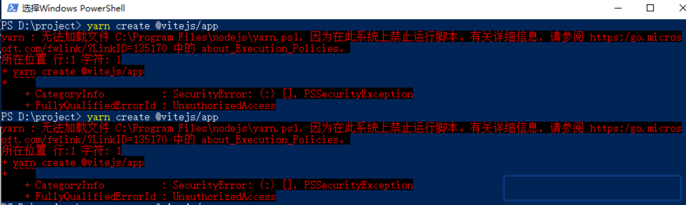
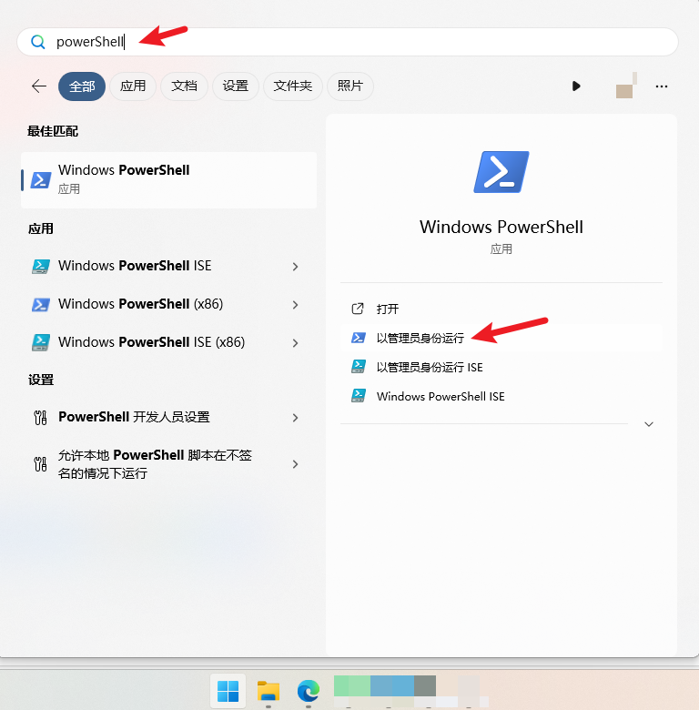
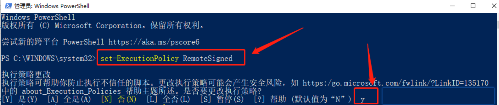
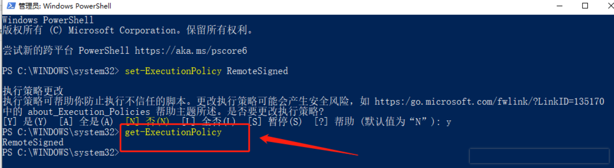

# yarn : 无法加载文件 C:\Program Files\nodejs\yarn.ps1，因为在此系统上禁止运行脚本。

## 解决办法：

### 一、点击电脑右下角的开始，菜单出来后，直接按键盘输入powerShell搜索，会出现下图，然后右键以管理员身份运行

### 二、以管理员运行后，会出现下面命令窗口，在窗口上执行：set-ExecutionPolicy RemoteSigned，然后输入Y，按Enter确认

### 三、查看执行策略：get-ExecutionPolicy

### 四、关闭命令窗口

完成上述四个步骤后，就可以解决出现无法加载文件，xxxx在此系统上禁止运行脚本。