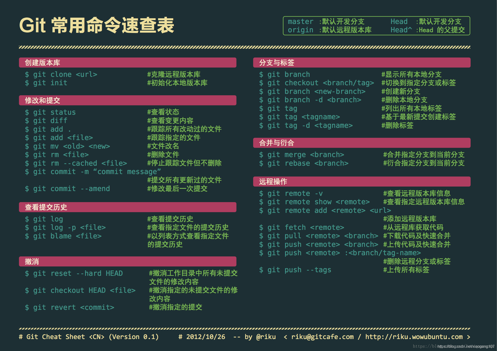

# Git常用命令速查表



## 1.强制推送（慎用，除非你认为其他冲突等可以丢弃 或者不是很重要）

``` git push -- force ```

## 2.创建文件等小命令

```
touch a // 创建一个a文件
echo 1234 >> a // 把1234这个内容放入a文件
cat a // 打开a文件 读取出a文件中的内容
mkdir test // 创建test文件夹
rm 文件名 // 删除文件
pwd // 打印当前工作路径
```

## 3.安装git的时候 都会安装git bash和git GUI 我们完全也可以使用git GUI来提交版本 与sourcetree等功能相同

``` gitk // 用git命令快速打开git GUI ```

## 4.文件信息

```
ls // 查看当前路径下面的所有文件名
ls 文件夹名 // 查看对应文件夹中的内容
ls -l // 拉出最近git提交记录以及对应修改的文件名
ls -l -a // 拉出最近git提交记录以及对应修改的文件名，隐藏的文件也会显示
```

## 5.cd快速切换路径

```
cd ~ // 将工作路径快速切换到root
cd - // 将工作路径切换到上一状态
cd ../ // 切回到上一个工作路径
cd 文件夹名 // 进入某个目录
cd / // 进入根目录
```

## 6. vim模式

```
vim 文件名 // 新建一个文件
i 插入内容
按下esc :wq 保存并退出
按下esc :q 直接退出
vim 模式下 文件中#号开头的为注释
.project 忽略.project文件
*.obj 或者 *.exe 忽略一类文件 例如以.obj .exe 结尾的文件 
git check-ignore -v .project 查看ignore中.project的位置
```

## 7.常用git 命令

```
git init // 初始化 在工作路径上创建主分支
git clone 地址 // 克隆远程仓库
git clone -b 分支名 地址 // 克隆分支的代码到本地
git status // 查看状态
git add 文件名 // 将某个文件存入暂存区
git add b c //把b和c存入暂存区
git add . // 将所有文件提交到暂存区
git add -p 文件名 // 一个文件分多次提交
git stash -u -k // 提交部分文件内容 到仓库 例如本地有3个文件 a b c 只想提交a b到远程仓库 git add a b 然后 git stash -u -k 再然后git commit -m "备注信息" 然后再push push之后 git stash pop 把之前放入堆栈的c拿出来 继续下一波操作
git commit -m "提交的备注信息"  // 提交到仓库
若已经有若干文件放入仓库，再次提交可以不用git add和git commit -m "备注信息" 这2步， 直接用git commit -am "备注信息" // 将内容放至仓库 也可用git commit -a -m "备注信息"
* git commit中的备注信息尽量完善 养成良好提交习惯 例如 git commit -m "变更(范围)：变更的内容"
```

## 8.存储密码凭证 设置别名 获取config信息以及配置

```
git config --list // 获取config信息
git config --global core.safecrlf false // 去掉git add 命令后 出现的一堆CR LF提示信息，其中CR是回车的意思 LF是换行
git config --global credential.helper wincred // 存储凭证 (可用于输入一次用户密码后，不再输入 有时我们已经用SSH key 绑定关联好了 但是每次git提交的时候 还是需要你输入用户名密码 在这个时候 敲入这个命令 将凭证存储起来 用户名密码就不需要再次输入了)
git config --global alias.ci commit // 将commit命令设置别名ci git commit命令将由git ci来代替
```

## 9.查看git常用命令

``` git helper -a // 查看全部git子命令 ```

## 10.逐行查看文件的修改历史

```
git blame 文件名 // 查看该文件的修改历史
git blame -L 100,10 文件名 // 从100行开始，到110行 逐行查看文件的修改历史
```

## 11.清除

```
git clean -n // 列出打算清除的档案(首先会对工作区的内容进行提示)
git clean -f // 真正的删除
git clean -x -f // 连.gitignore中忽略的档案也删除
git status -sb (sb是 short branch) // 简洁的输出git status中的信息
```

## 12.删除放入暂存区文件的方法（已commit后）

```
git rm 文件名 // 将该文件从commit后撤回到add后
git reset HEAD^ --hard // 删除后 可以用git rm 文件名再回撤一步
```

## 13.查看提交内容

```
git hi -5 // 查看前5条内容
git hi --grep hello // 过滤提交信息里有hello字眼的内容
```

## 14.修改文件名以及移动

```
git mv a b // 把a文件名字改成b 并且直接放入git add后的暂存区
git mv b ./demos/ // 把b文件移动到demos文件夹下
```

## 15.对比工作区，暂存区，仓库的差异

```
git diff // 查看变更 工作区与暂存区的差异比对
git diff --cached // 暂存区与提交版本的差异
git diff HEAD // 工作区与仓库中最后一次提交版本的差别
git diff 版本哈希值 版本哈希值 // 查看这2个版本哈希之间的区别
或者 git diff HEAD~数字 HEAD~数字
 
git tag tt HEAD~4 给倒数第5次提交打一个tag tag名字是tt
git diff tt 就是倒数第5个版本与第一个版本之间的差异
git diff --cached tt 暂存区与倒数第5个版本之间的比对
```

## 16.查看提交信息

```
git show HEAD // 查看最后一次提交修改的详细信息 也可以用git show 哈希值 查看对应的内容
git show HEAD^ // 查看倒数第二次的提交修改详细信息
git show HEAD^^ 或者git show HEAD~2 查看前2次变更
git show HEAD 或 git show 哈希值 或者git show tag(标签名) 都可以查看最近一次提交的详细信息
```

## 17.查看信息

```
git log --pretty=format:'%h %ad | %s%d [%an]' --graph --date=short
// 获取git log里的树形详细信息 包括hasg 日期 提交信息 提交人等
git log --oneline //拉出所有提交信息 q是退出
git log -5 // 查看前5次的提交记录
git log --oneline -5 // 打印出的日志里面只有哈希值和修改的内容备注
git log 文件名 // 查看该文件的提交
git log --grep // 想过滤看到的内容   过滤日志
git log -n // 查看近期提交的n条信息内容
git log -p // 查看详细提交记录
```

## 18.变基操作，改写历史提交 把多次提交合并起来

```
git rebase -i HEAD~3 变基之后的哈希值与之前的不同 证明变基是重新做的提交 把多次提交合并成了几次提交
```

## 19.回撤操作

```
git commit --amend -m "提交信息" // 回撤上一次提交并与本次工作区一起提交
git reset HEAD~2 --hard // 回撤2步
git reset --files // 从仓库回撤到暂存区
git reset HEAD // 回撤暂存区内容到工作目录
git reset HEAD --soft 回撤提交到暂存区
git reset HEAD --hard // 回撤提交 放弃变更 (慎用)
git reset HEAD^  // 回撤仓库最后一次提交
git reset --hard commitid // 回撤到该次提交id的位置
git push -f -u origin 分支名 所有内容都回撤完了 将回撤后的操作强制推送到远程分支
```

## 20.标签操作

```
git tag // 查看列出所有打过的标签名
git tag -d 标签名 // 删除对应标签
git tag 标签名字 // 在当前仓库打个标签
git tag foo -m "message" // 在当前提交上，打标签foo 并给message信息注释
git tag 标签名 哈希值 -m "message" // 在某个哈希值上打标签并且写上标签的信息
git tag foo HEAD~4 // 在当前提交之前的第4个版本上 打标签foo
git push origin --tags // 把所有打好的标签推送到远程仓库
git push origin 标签名 // 把指定标签推送到远程仓库
git stash // 把暂存区的内容 暂时放在其他中 使暂存区变空
git stash list // 查看stash了哪些存储
git stash pop // 将stash中的内容恢复到当前目录，将缓存堆栈中的对应stash删除
git stash apply // 将stash中的内容恢复到当前目录，不会将缓存堆栈中的对应stash删除
git stash clear // 删除所有缓存的stash
git pull --tags // 把远程仓库的标签也拉取下来
git push origin :refs/tags/远程标签名 // 删除远程仓库的标签
```

## 21.分支

```
git branch 分支名 // 新建分支
git branch // 查看当前所有分支
git checkout 分支名 // 检出分支
git checkout -b 分支名 // 创建并切换分支
git checkout commitId 文件名（文件路径下的文件名） 还原这个文件到对应的commitId的版本
（例如src/page/attendance/attendanceSum.vue我想把它还原到2个版本之前 首先git log src/page/attendance/attendanceSum.vue找到对应想要还原的版本
复制版本提交的commitID 然后执行git checkout commitID src/page/attendance/attendanceSum.vue
这样就把attendanceSum.vue这个单个文件 还原到了对应版本）
git branch -v // 查看分支以及提交hash值和commit信息
git merge 分支名 // 把该分支的内容合并到现有分支上
git branch -d 分支名 // 删除分支
git branch -D 分支名 // 强制删除 若没有其他分支合并就删除 d会提示 D不会
git branch -m 旧分支名 新分支名 // 修改分支名
git branch -M 旧分支名 新分支名 // 修改分支名 M强制修改 若与其他分支有冲突也会创建(慎用)
git branch -r // 列出远程分支(远程所有分支名)
git branch -a // 查看远程分支(列出远程分支以及本地分支名)
git fetch // 更新remote索引
git push -u origin 分支名 // 将本地分支推送到origin主机，同时指定origin为默认主机，后面就可以不加任何参数使用git push 也可解决 git建立远程分支关联时出现fatal ... upstram的问题
```