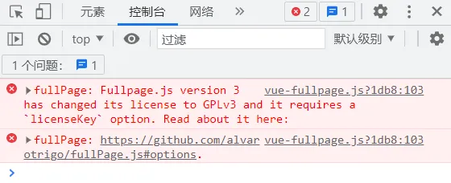
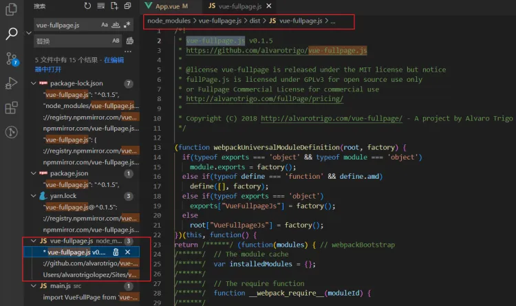
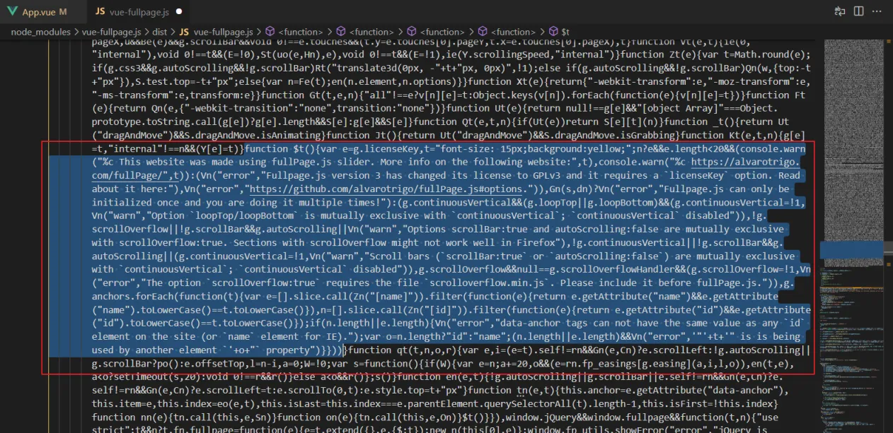
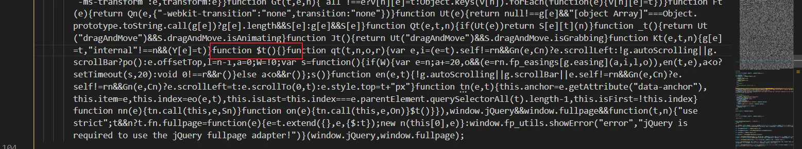

# Vue-fullpage基础用法

## 0.前言

### vue-fullpage.js 用于创建类似幻灯片的全屏滚动效果。
### 官网地址1  [https://github.com/alvarotrigo/vue-fullpage.js](https://github.com/alvarotrigo/vue-fullpage.js)
### 官网地址2  [https://alvarotrigo.com/fullPage/zh/#page1](https://alvarotrigo.com/fullPage/zh/#page1)
### Demo演示  [jQuery全屏滚动插件fullPage.js演示_dowebok](https://www.dowebok.com/demo/2014/77/)
### 代码在线调试   [https://codepen.io/alvarotrigo/pen/zpQmwq?editors=1000](https://codepen.io/alvarotrigo/pen/zpQmwq?editors=1000)


## 1.安装

> npm install --save vue-fullpage.js

上面无法安装请安装旧版本
> npm install --save vue-fullpage.js@0.1.5

## 2.配置

### main.js中

```javascript
// 全屏滚动 vue-fullpage.js
import 'fullpage.js/vendors/scrolloverflow';
import VueFullpage from 'vue-fullpage.js'
Vue.use(VueFullpage)
```

### public/index.html 中的 标签内

```javascript
<!--全屏滚动插件-vue-fullpage.js的样式-->
<link rel="stylesheet" type="text/css" href="https://unpkg.com/fullpage.js/dist/fullpage.min.css">
```

## 3.使用

.vue文件中，每个``<div class="section"></div>``为一页，其中的``<div class="slide"> </div>``为横向子页。

```vue
<template>
<div>
  <full-page :options="options" ref="fullpage">
    <div class="section">
      <h3>vue-fullpage.js</h3>
  </div>
    <div class="section">
      <div class="slide">
        <h3>Slide 2.1</h3>
  </div>
      <div class="slide">
        <h3>Slide 2.2</h3>
  </div>
      <div class="slide">
        <h3>Slide 2.3</h3>
  </div>
  </div>
    <div class="section">
      <h3>Section 3</h3>
  </div>
  </full-page>
  </div>
</template>
```

### options 配置:

```vue
<script>
    export default {
        data() {
            return {
                options: {
                    licenseKey: "OPEN-SOURCE-GPLV3-LICENSE",
                    //是否显示导航，默认为false
                    navigation: true,
                    //为每个section设置背景色
                    sectionsColor: [
                        "#41b883",
                        "#ff5f45",
                        "#0798ec",
                        "#fec401",
                        "#1bcee6",
                        "#ee1a59",
                        "#2c3e4f",
                        "#ba5be9",
                        "#b4b8ab"
                    ],
                }
            }
        }
    }
</script>
```
### 其他options 配置:

```javascript
//导航小圆点的位置，left或者right,默认为right
navigationPosition: 'left',
//是否可以使用键盘方向键导航（上下键翻页），默认为true
keyboardScrolling: true,
//是否显示两侧的箭头
controlArrows: false,
//每一页幻灯片的内容是否垂直居中，默认为true
verticalCentered: true,
//字体是否随着窗口缩放而缩放 默认为true
resize: true,
//页面滚动速度
scrollingSpeed: 700,
//定义锚链接，用户可以快速打开定位到某一页面；不需要加"#"，不要和页面中任意的id和name相同
anchors: ["page1", "page2", "page3"],
//是否锁定锚链接
lockAnchors: true,
//定义section页面的滚动方式，需要引入jquery.easings插件
easing:'',
//是否使用css3 transform来实现滚动效果
css3: false,
//滚动到最顶部后是否连续滚动到底部
loopTop: true,
//滚动到最底部后是否连续滚动到顶部
loopBottom: true,
//横向slide幻灯片是否循环滚动
loopHorizontal: false,
//是否循环滚动，不会出现跳动，效果很平滑
continuousVertical: true,
//是否使用插件滚动方式，设为false后，会出现浏览器自带的滚动条，将不会按页滚动
autoScrolling: false,
//是否包含滚动条，设为true，则浏览器自带的滚动条会出现，页面还是按页滚动，但是浏览器滚动条默认行为也有效
scrollBar: true,
//设置每个section顶部的padding，当我们要设置一个固定在顶部的菜单、导航、元素等时使用
paddingTop: "100px",
//设置每个section底部的padding，当我们要设置一个固定在底部的菜单、导航、元素等时使用
paddingBottom: "100px",
//固定的元素，为jquery选择器；可用于顶部导航等
fixedElements: ".nav",
//在移动设置中页面敏感性，最大为100，越大越难滑动
touchSensitivity: 5,
//设为false，则通过锚链接定位到某个页面不再有动画效果
animateAnchor: false,
//是否记录历史，可以通过浏览器的前进后退来导航
recordHistory: true,
//绑定菜单，设定相关属性和anchors的值对应后，菜单可以控制幻灯片滚动
menu: '.nav',
// 鼠标移动到小圆点上时显示出的提示信息
navigationTooltips: ["第一页","第二页","第三页"],
// 是否显示当前页面小圆点导航的提示信息，不需要鼠标移上
showActiveTooltip: true,
// 是否显示横向幻灯片的导航
slidesNavigation: true,
// 横向幻灯片导航的位置，可以为top或者bottom
slidesNavPosition: 'bottom',
// 内容超过满屏时是否显示滚动条，需要jquery.slimscroll插件
scrollOverflow: true,
// section选择器
sectionSelector: ".section",
// slide选择器
slideSelector: ".slide"
```

## 4.调用 API

```javascript
// 向下滚动一页
this.$refs.fullpage.api.moveSectionDown();
```

### 其他 API

```javascript
// 向上滚动一页
moveSectionUp();
//向下滚动一页
moveSectionDown();
//滚动到第几页，第几个幻灯片；页面从1计算，幻灯片从0计算
moveTo(wection,slide);
//和moveTo一样，但是没有动画效果
silentMoveTo(section,slide);
//幻灯片向右滚动
moveSlideRight();
//幻灯片向左滚动
moveSlideLeft();
//动态设置autoScrolling配置项
setAutoScrolling(boolean);
//动态设置lockAnchors配置项
setLockAnchors(boolean);
//动态设置recordHistory配置项
setRecordHistory(boolean);
//动态设置scrollingSpeed配置项
setScrollingSpeed(milliseconds);
//添加或删除鼠标/滑动控制，第一个参数为启用、禁用；第二个参数为方向，取值包含all、up、dowm、left、right，可以使用多个，逗号分隔
setAllowScrolling(boolean,[directions]);
//销毁fullpage特效，不写type，fullpage给页面添加的样式和html元素还在；如果使用all，则样式和html等全部被销毁
destroy(type);
//重新更新页面和尺寸，用于通过ajax请求后改变了页面结构之后，重建效果
reBuild();
```

## 5.完整范例代码

```vue
<template>
<div>
  <full-page :options="options" ref="fullpage">
    <div class="section">
      <div style="text-align: center">
        <h1 style="color: white;margin:0;">小米手机拍照效果</h1>
        <button @click="next">下一页</button>
  </div>
  </div>
    <div class="section">
      <div class="slide">
        <div style="height: 100vh">
          
  </div>
  </div>
      <div class="slide">
        <div style="height: 100vh">
          
  </div>
  </div>
      <div class="slide">
        <div style="height: 100vh">
          
  </div>
  </div>
  </div>
    <div class="section">
      <div class="box3">
        <div style="height: 100vh">
          
  </div>
  </div>
  </div>
  </full-page>
  <div>
  </div>
  </div>
</template>
<script>
  export default {
    data() {
      return {
        options: {
          licenseKey: "OPEN-SOURCE-GPLV3-LICENSE",
          //是否显示导航，默认为false
          navigation: true,
          //为每个section设置背景色
          sectionsColor: [
            "#41b883",
            "#ff5f45",
            "#0798ec",
            "#fec401",
            "#1bcee6",
            "#ee1a59",
            "#2c3e4f",
            "#ba5be9",
            "#b4b8ab"
          ],
        }
      }
    },
    methods: {
      next() {
        // 向下滚动一页
        this.$refs.fullpage.api.moveSectionDown();
      }
    }
  }
</script>
```

## 6.注意事项：

### 1.依赖包版本问题
:::info
Vue2 建议安装这个旧版本
npm install --save vue-fullpage.js@0.1.5
:::

### 2.运行代码后，正常能运行但会出现**licenseKey**报错



报错内容：
fullPage: Fullpage.js version 3 has changed its license to GPLv3 and it requires a licenseKey option. Read about it here:

网上搜索解决方案，统一全部是：
在fullpage.js文件中查找licenseKey，删除如下代码

```javascript
if*(!isOK){
  showError(‘error’, ‘Fullpage.js version 3 has changed its license to GPLv3 and it requires a licenseKey option. Read about it here:’);
  showError(‘error’, ‘https://github.com/alvarotrigo/fullPage.js#options.’);
}***
```

于是试了试，发现无效，后发现node_modules里面的fullpage.js并不是项目中使用到的插件，项目中用到的是vue-fullpage.js。修改整个fullpage.js甚至完全格式化都并不影响项目运行。于是继续去vue-fullpage找答案，在vue-fullpage的dist文件夹下找到了vue-fullpage.js文件，将下面的 function $ t里面的内容全部清空后问题解决。
以下为$ t中的内容：

```javascript
var e=g.licenseKey,t=“font-size: 15px;background:yellow;”;n?e&&e.length<20&&(console.warn("%c This website was made using fullPage.js slider. More info on the following website:",t),console.warn("%c https://alvarotrigo.com/fullPage/",t)):(Vn(“error”,“Fullpage.js version 3 has changed its license to GPLv3 and it requires a licenseKey option. Read about it here:”),Vn(“error”,“https://github.com/alvarotrigo/fullPage.js#options.”)),Gn(s,dn)?Vn(“error”,“Fullpage.js can only be initialized once and you are doing it multiple times!”):(g.continuousVertical&&(g.loopTop||g.loopBottom)&&(g.continuousVertical=!1,Vn(“warn”,“Option loopTop/loopBottom is mutually exclusive with continuousVertical; continuousVertical disabled”)),!g.scrollOverflow||!g.scrollBar&&g.autoScrolling||Vn(“warn”,“Options scrollBar:true and autoScrolling:false are mutually exclusive with scrollOverflow:true. Sections with scrollOverflow might not work well in Firefox”),!g.continuousVertical||!g.scrollBar&&g.autoScrolling||(g.continuousVertical=!1,Vn(“warn”,“Scroll bars (scrollBar:true or autoScrolling:false) are mutually exclusive with continuousVertical; continuousVertical disabled”)),g.scrollOverflow&&null==g.scrollOverflowHandler&&(g.scrollOverflow=!1,Vn(“error”,“The option scrollOverflow:true requires the file scrolloverflow.min.js. Please include it before fullPage.js.”)),g.anchors.forEach(function(t){var e=[].slice.call(Zn("[name]")).filter(function(e){return e.getAttribute(“name”)&&e.getAttribute(“name”).toLowerCase()==t.toLowerCase()}),n=[].slice.call(Zn("[id]")).filter(function(e){return e.getAttribute(“id”)&&e.getAttribute(“id”).toLowerCase()==t.toLowerCase()});if(n.length||e.length){Vn(“error”,“data-anchor tags can not have the same value as any id element on the site (or name element for IE).”);var o=n.length?“id”:“name”;(n.length||e.length)&&Vn(“error”,’"’+t+’" is is being used by another element '+o+" property")}}))

```

### 3.具体操作：

#### 1.找到vue-fullpage.js文件



#### 2.找到 function $t(){} 位置



#### 3.function $t(){} 花括号里的内容清空掉，保存再重启服务器即可


