# OpenLayers在线瓦片数据源汇总

## 1、概述

瓦片地图（切片地图）源于一种大地图解决方案，针对一整块非常大的地图进行切片，分成很多相同大小的小块地图，在用户访问的时候，再一块一块小地图加载，拼接在一起，从而还原成一整块大的地图，如果要提高Web地图的访问速度，使用瓦片地图是非常有效的方法。

瓦片地图采用的是金字塔模型，是一种多分辨率层次模型，从瓦片金字塔的底层到顶层，比例尺越来越小，分辨率越来越低，但表示的地理范围不变。瓦片地图通常都带有一个级别、行与列编号方案，以便将来自多个瓦片地图服务的瓦片放置到正确的位置。


在WebGIS中，上一层级的一张瓦片，在更大一层级中，会用4张瓦片来表示，依次类推，比如上一节中看到的Google在线瓦片地图的第0级和第1级的瓦片地图。这样做可以维持正方形的投影方式不变，同时按照2的幂次方放大（瓦片的边长），计算效率非常高。

通过上面切片的介绍，我们可以对每一层级瓦片的数量进行简单的计算：

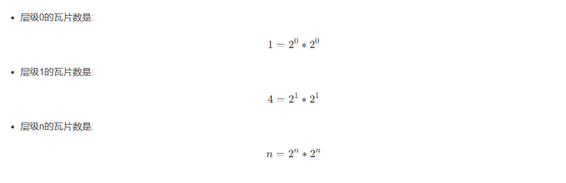

这个地方计算的是所有瓦片数，因为是一个正方形，所以是边长的平方。如果只计算x轴或y轴一边的瓦片数，就是2^n个。

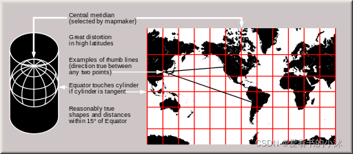

## 2、地图数据源

腾讯、高德是GCJ02坐标系，百度是BD09坐标系，谷歌、必应是WGS84坐标系，天地图是CGCS2000坐标系，瓦片地图都是平面墨卡托投影。WGS84和CGCS2000坐标系，近似认为它们相等就可以。

|    地图商     | 瓦片编码 |
| :-----------: | :------: |
|   高德地图    | 谷歌XYZ  |
|   谷歌地图    | 谷歌XYZ  |
| OpenStreetMap | 谷歌XYZ  |
|   腾讯地图    |   TMS    |
|   Bing地图    | QuadTree |
|   百度地图    | 百度XYZ  |


### 2.1 Google

谷歌地图使用了四个服务地址，即 http://mt(0~3).google.cn/

lyrs：类型
lyrs=h：roads only，标签层（路名、地名等）
lyrs=m：standard roadmap，路线图
lyrs=p：terrain，带标签的地形图
lyrs=r：somehow altered roadmap
lyrs=s：satellite only，卫星图
lyrs=t：terrain only，地形图
lyrs=y：hybrid，带标签的卫星图
gl：坐标系
gl=CN：中国火星坐标系
hl：地图文字语言
hl=zh-CN：中文
hl=en-US：英文
x=瓦片横坐标：x瓦片的横向索引，起始位置为最左边，数值为0，向右+1递增。
y=瓦片纵坐标：y瓦片的纵向索引，起始位置为最上面，数值为0，向下+1递增。
z=缩放级别：卫星图0-14，路线图0-17，z地图的级别Zoom(0~22)，最上一级为0，向下依次递增。

```
// 谷歌影像：(​s：卫星图)
http://www.google.cn/maps/vt?lyrs=s@189&gl=cn&x={x}&y={y}&z={z}
// 谷歌矢量：(m：路线图)
http://mt1.google.cn/vt/lyrs=m&scale=2&hl=zh-CN&gl=cn&x={x}&y={y}&z={z}
// 谷歌路网：(h：标签层（路名、地名等）)
https://mt1.google.com/vt/lyrs=h&x={x}&y={y}&z={z}
// 谷歌影像带注记：(y：带标签的卫星图)
https://mt1.google.com/vt/lyrs=y&x={x}&y={y}&z={z}
// 谷歌地形：(t：地形图)
https://mt1.google.com/vt/lyrs=t&x={x}&y={y}&z={z}
// 谷歌地图矢量带地形渲染：
https://mt1.google.com/vt/lyrs=r&x={x}&y={y}&z={z}

// 其他
http://www.google.cn/maps/vt/pb=!1m4!1m3!1i'+str(zoom)+'!2i'+str(x)+'!3i'+str(y)+'!2m3!1e0!2sm!3i345013117!3m8!2szh-CN!3scn!5e1105!12m4!1e68!2m2!1sset!2sRoadmap!4e0
影像的叠加：http://mt1.google.cn/vt/imgtp=png32&lyrs=h&hl=zh-CN&gl=cn&x=...
```

```
# 地图图层说明：
# h skeleton map light http://mt2.google.cn/vt/lyrs=h&hl=zh-CN&gl=cn&x=420&y=193&z=9
# m 全地图 http://mt2.google.cn/vt/lyrs=m&hl=zh-CN&gl=cn&x=420&y=193&z=9
# p terrain+map http://mt2.google.cn/vt/lyrs=p&hl=zh-CN&gl=cn&x=420&y=193&z=9
# r skeleton map dark http://mt2.google.cn/vt/lyrs=r&hl=zh-CN&gl=cn&x=420&y=193&z=9
# y hybrid satellite map http://mt1.google.cn/vt/lyrs=y&hl=zh-CN&gl=cn&x=420&y=193&z=9
# t 地形图 http://mt0.google.cn/vt/lyrs=t&hl=zh-CN&gl=cn&x=420&y=193&z=9
# s 卫星地图 http://mt3.google.cn/vt/lyrs=s&hl=zh-CN&gl=cn&x=420&y=193&z=9
# 也可以进行组合，例如：s,r 或者 t,h http://mt3.google.cn/vt/lyrs=t,h&hl=zh-CN&gl=cn&x=420&y=193&z=9
```

```
private static String Google_Satellite_Url = "http://mt0.google.cn/vt/lyrs=y&hl=zh-CN&hl=zh-CN&gl=CN&x={x}&y={y}&z={z}&s=Gali";
private static String Google_Image_Url = "http://mt0.google.cn/vt/lyrs=m&hl=zh-CN&hl=zh-CN&gl=CN&x={x}&y={y}&z={z}&s=Gali";
private static String Google_Terrain_Url = "http://mt0.google.cn/vt/lyrs=p&hl=zh-CN&hl=zh-CN&gl=CN&x={x}&y={y}&z={z}&s=Gali";
```

```
var tileUrl = 'http://{s}.google.com/vt/lyrs=m@159000000&'+ 'hl=zh-CN&gl=cn&x={x}&y={y}&z={z}&s=Gali',
var tileSubdomains = ['mt0', 'mt1', 'mt2', 'mt3'];
```

### 2.2 OpenStreetMap

[https://www.openstreetmap.org/](https://www.openstreetmap.org/)

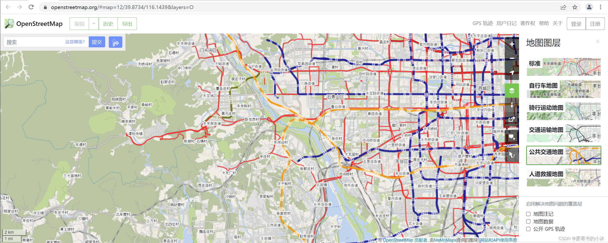

OpenStreetMap（简称OSM）是一个网上地图协作计划，目标是创造一个内容自由且能让所有人编辑的世界地图。该平台的数据可以自由下载。OpenStreetMap（简称OSM）不仅可以免费在线使用，还可以免费下载原始数据，数据格式有.osm.pbf和shp。

```
// OSM瓦片网页地址：
https://tile.openstreetmap.org/{z}/{x}/{y}.png
https://c.tile.openstreetmap.org/{z}/{x}/{y}.png
https://tile-b.openstreetmap.fr/hot/{z}/{x}/{y}.png
```

```
// OSM经纬度网页地址：
https://www.openstreetmap.org/#map=18/39.99476/116.30986&layers=O
```

```
//OSM Cycle Map 
http://tile.thunderforest.com/cycle/{z}/{x}/{y}.png
//OSM Black and White 
http://tiles.wmflabs.org/bw-mapnik/{z}/{x}/{y}.png
//Stamen Terrain 
http://a.tile.stamen.com/terrain/{z}/{x}/{y}.png
//Carto Positron 
https://cartodb-basemaps-a.global.ssl.fastly.net/light_all/{z}/{x}/{y}.png
//cartocdn light nolabels 
https://basemaps.cartocdn.com/light_nolabels/{z}/{x}/{y}{r}.png
```

|    Name     | URL template | zoomlevels |
| :-----------: | :------: | :------: |
|   OSM ‘standard’ style    | http://[abc].tile.openstreetmap.org/zoom/x/y.png  | 0-19 |
|   OpenCycleMap    | http://[abc].tile.thunderforest.com/cycle/zoom/x/y.png  | 0-22  |
| Thunderforest Transport | http://[abc].tile.thunderforest.com/transport/zoom/x/y.png  | 0-22  |
|   MapQuest As of July 11, 2016, direct tile access has been discontinued.    |   http://otile[1234].mqcdn.com/tiles/1.0.0/osm/zoom/x/y.jpg (“otile1-s.mqcdn.com” etc. for https)    | 0-18  |
|   MapQuest Open Aerial, As of July 11, 2016, direct tile access has been discontinued.    | http://otile[1234].mqcdn.com/tiles/1.0.0/sat/zoom/x/y.jpg | 0-11 globally, 12+ in the U.S.  |
|   Stamen Terrain    | http://tile.stamen.com/terrain-background/zoom/x/y.jpg  | 4-18, US-only (for now)  |

### 2.3 Thunderforest

[https://www.thunderforest.com/maps/opencyclemap/](https://www.thunderforest.com/maps/opencyclemap/)

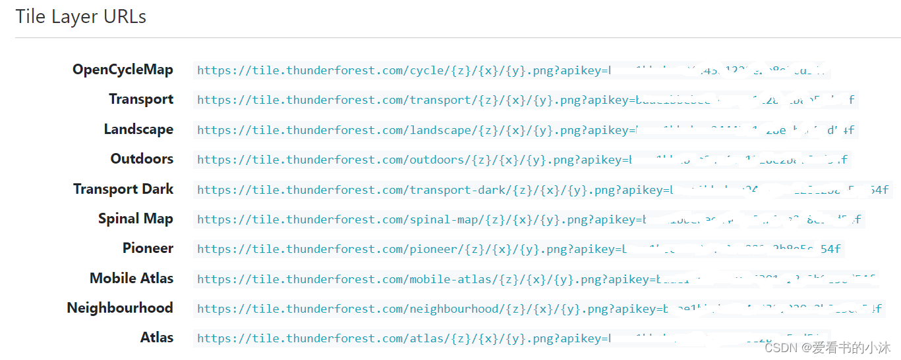
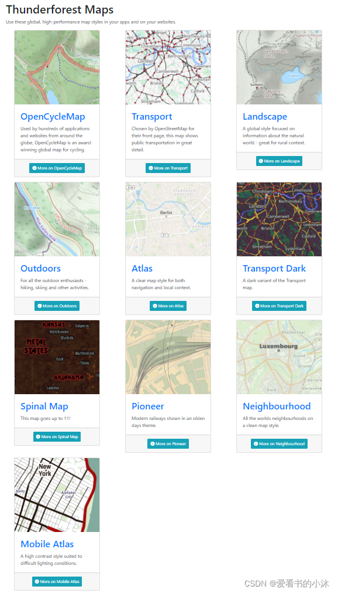
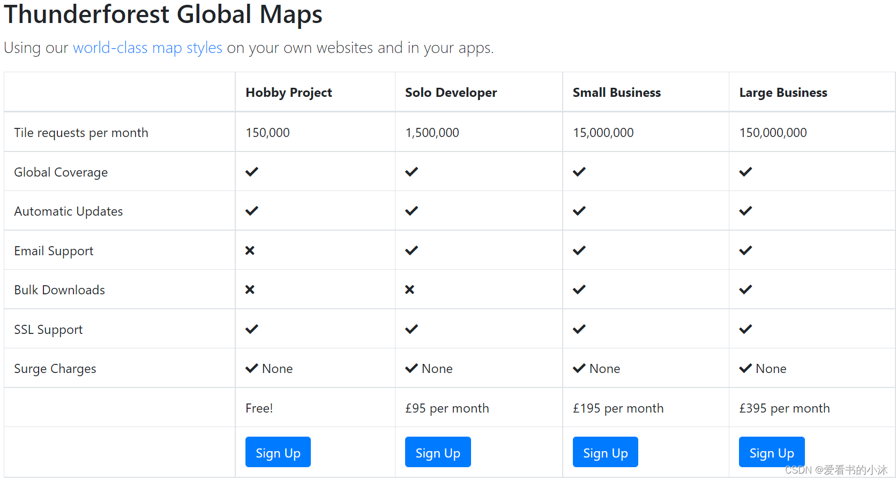

### 2.4 Mapbox

[https://www.mapbox.com/](https://www.mapbox.com/)
[https://docs.mapbox.com/api/maps/static-tiles/](https://docs.mapbox.com/api/maps/static-tiles/)

```
https://api.mapbox.com/styles/v1/{username}/{style_id}/tiles/{tilesize}/{z}/{x}/{y}{@2x}

# Returns a default 512×512 pixel tile as a JPEG
$ curl "https://api.mapbox.com/styles/v1/mapbox/satellite-v9/tiles/1/1/0?access_token=your key"

# Returns a 1024×1024 pixel tile as a JPEG
$ curl "https://api.mapbox.com/styles/v1/mapbox/satellite-v9/tiles/512/1/1/0@2x?access_token=your key"
```

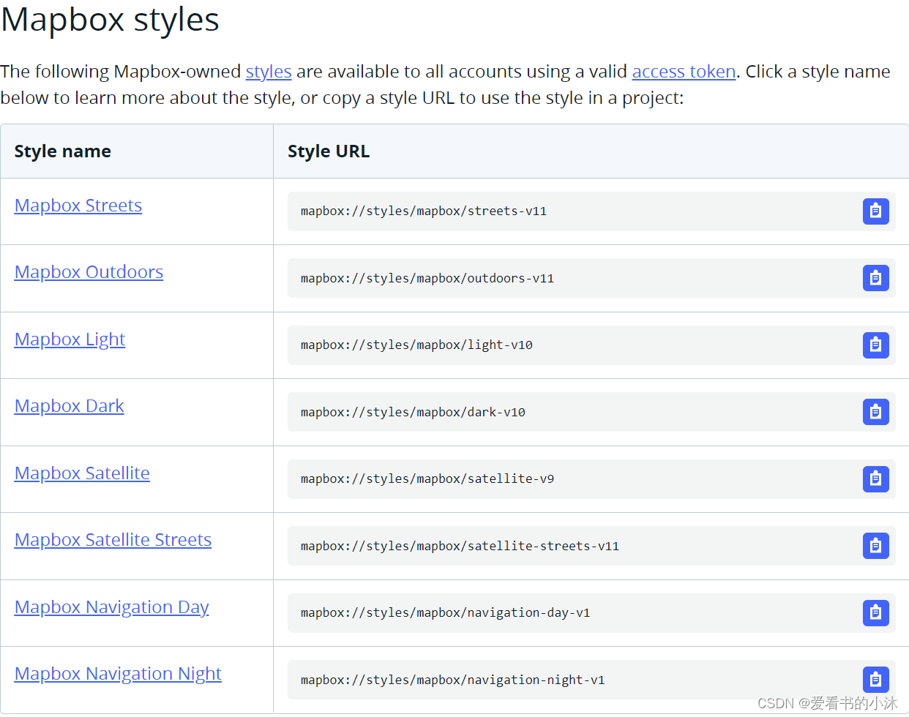

### 2.5 ArcGIS

[http://map.geoq.cn/ArcGIS/rest/services](http://map.geoq.cn/ArcGIS/rest/services)

```
ChinaOnlineCommunity_Mobile (MapServer)
ChinaOnlineCommunityENG (MapServer)
ChinaOnlineCommunity (MapServer)
ChinaOnlineStreetGray (MapServer)
ChinaOnlineStreetPurplishBlue (MapServer)
ChinaOnlineStreetWarm (MapServer)
```

```
// 街道图：
https://map.geoq.cn/ArcGIS/rest/services/ChinaOnlineCommunity/MapServer/tile/{z}/{y}/{x}
// 灰色图：
https://map.geoq.cn/ArcGIS/rest/services/ChinaOnlineStreetGray/MapServer/tile/{z}/{y}/{x}
// 深蓝夜色：
https://map.geoq.cn/ArcGIS/rest/services/ChinaOnlineStreetPurplishBlue/MapServer/tile/{z}/{y}/{x}

// 其他,Esri World Image瓦片地址
https://services.arcgisonline.com/arcgis/rest/services/World_Imagery/MapServer/tile/{z}/{y}/{x}
https://server.arcgisonline.com/ArcGIS/rest/services/World_Imagery/MapServer/tile/{z}/{y}/{x}

//Esri Imagery/Satellite 
https://server.arcgisonline.com/ArcGIS/rest/services/World_Imagery/MapServer/tile/{z}/{y}/{x}

//Esri Streets 
https://server.arcgisonline.com/ArcGIS/rest/services/World_Street_Map/MapServer/tile/{z}/{y}/{x}

//Esri Topo 
https://server.arcgisonline.com/ArcGIS/rest/services/World_Topo_Map/MapServer/tile/{z}/{y}/{x}

//World Light Gray Base 
https://server.arcgisonline.com/ArcGIS/rest/services/Canvas/World_Light_Gray_Base/MapServer/tile/{z}/{y}/{x}

```

举例1（北大未名湖）：

```
https://map.geoq.cn/ArcGIS/rest/services/ChinaOnlineCommunity/MapServer/tile/18/99247/215766
http://wprd02.is.autonavi.com/appmaptile?x=215766&y=99247&z=18&style=7
```

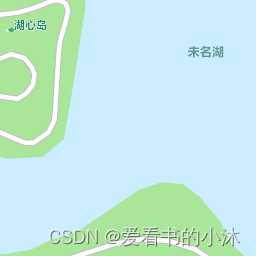

举例2（北大未名湖）：

```
https://services.arcgisonline.com/arcgis/rest/services/World_Imagery/MapServer/tile/18/99247/215766
https://a.tile.openstreetmap.org/18/215766/99247.png
```

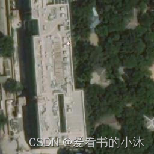

举例3（纽约旁的小岛）：

```
https://services.arcgisonline.com/arcgis/rest/services/World_Imagery/MapServer/tile/18/98434/77343
https://a.tile.openstreetmap.org/18/77343/98434.png
```
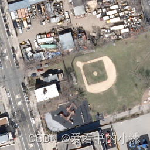

### 2.6 Bing地图

[Bing Maps Tile System，https://docs.microsoft.com/en-us/bingmaps/articles/bing-maps-tile-system?redirectedfrom=MSDN](https://docs.microsoft.com/en-us/bingmaps/articles/bing-maps-tile-system?redirectedfrom=MSDN)

Bing Maps的瓦片地图图片的URL的格式为:

```
http://ecn.t{0}.tiles.virtualearth.net/tiles/{1}{2}.png? g={4}
http://ecn.t3.tiles.virtualearth.net/tiles/a{q}.jpeg?g=1
```

| 参数 |              解释               |                    说明                    |
| :--: | :-----------------------------: | :----------------------------------------: |
| 0  | 代表Bing Maps的服务器，平衡负载 |   现在看来取值可以是0~7，也就是8台服务器   |
| 1  |            地图类型             |   卫星地图：a；普通地图：r；混合地图：h    |
| 2  |  瓦片地图图片键值（quadkey ）   | 通过对应地图区域的位置、显示尺度等计算而来 |
| 3  |          地图图片类型           |                 取值为png                  |
| 4  |            地图版本             |                     --                     |

quadkey和TileXY之间的映射

根据官方文档：在给定level下，把行号Y和列号X转换为2进制，然后行列交叉存储，再转换为4进制，即得到了相应的quadkey。譬如Level 3的第6行第4列的Tile计算：tileY = 5 = 101 ，tileX = 3 = 011；quadkey = 100111 = 213（4进制） = “213”。反过来计算就是quadkey到TileXY的转换。根据此方法，就很容易写quadkey到TileXY之间的转换代码。

### 2.7 高德地图

高德地图瓦片坐标与 Google Map、Open Street Map 相同。高德地图的墨卡托投影截取了纬度（约85.05ºS, 约85.05ºN）之间部分的地球，使得投影后的平面地图水平方向和垂直方向长度相等。将墨卡托投影地图的左上角作为瓦片坐标系起点，往左方向为X轴，X轴与北纬85.05º重合且方向向左；往下方向为Y轴，Y轴与东经180º（亦为西经180º）重合且方向向下。瓦片坐标最小等级为0级，此时平面地图是一个像素为256*256的瓦片。

高德地图的坐标是GCJ-02坐标（国内的所有地图都是，有的还进行了二次加偏）,高德的瓦片分割方式和谷歌的一样,style=7是路线图，6的话是卫星图。
高德的z取值范围是[1,19]。不过卫星图实测只能取到18。

瓦片请求地址参数说明如下：

| **变量**        | **说明**                                                     |
| --------------- | ------------------------------------------------------------ |
| 域名(wprd,wpst) | 据说wprd0前者是高德的新版地址，webst0后者是老版地址。        |
| lang            | zh_cn设置中文，en设置英文                                    |
| size            | 无作用                                                       |
| style           | 地图类型控制，6卫星（st），7简图（st rd），8详图（不透明rd，透明图st） |
| scl             | 尺寸控制，1=256,2=512                                        |
| ltype           | 只对地图要素进行控制                                         |

```
// 高德影像
https://webst01.is.autonavi.com/appmaptile?style=6&x={x}&y={y}&z={z}
// 高德路网
https://wprd01.is.autonavi.com/appmaptile?x={x}&y={y}&z={z}&lang=zh_cn&size=1&scl=2&style=8&ltype=3
// 高德矢量
http://wprd04.is.autonavi.com/appmaptile?lang=zh_cn&size=1&style=7&x={x}&y={y}&z={z}
```

```
// 高德道路纯图
https://wprd01.is.autonavi.com/appmaptile?lang=zh_cn&size=1&style=7&x=215766&y=99247&z=18&scl=1&ltype=2
// 高德道路简图
http://webrd01.is.autonavi.com/appmaptile?x=215766&y=99247&z=18&size=1&scale=1&style=7
// 高德道路详图
http://webrd01.is.autonavi.com/appmaptile?x=215766&y=99247&z=18&lang=zh_cn&size=1&scale=1&style=8
```

其他

```
url:"https://webst{s}.is.autonavi.com/appmaptile?x={x}&y={y}&z={z}&style=6", // 添加高德影像
subdomains:["01","02","03","04"] //多域名请求
```

```
private static String AMap_Satellite_Url = "http://webst02.is.autonavi.com/appmaptile?style=6&x={x}&y={y}&z={z}";
private static String AMap_Cover_Url = "http://webst02.is.autonavi.com/appmaptile?x={x}&y={y}&z={z}&lang=zh_cn&size=1&scale=1&style=8";
private static String AMap_Image_Url = "http://webrd03.is.autonavi.com/appmaptile?lang=zh_cn&size=1&scale=1&style=8&x={x}&y={y}&z={z}";
```

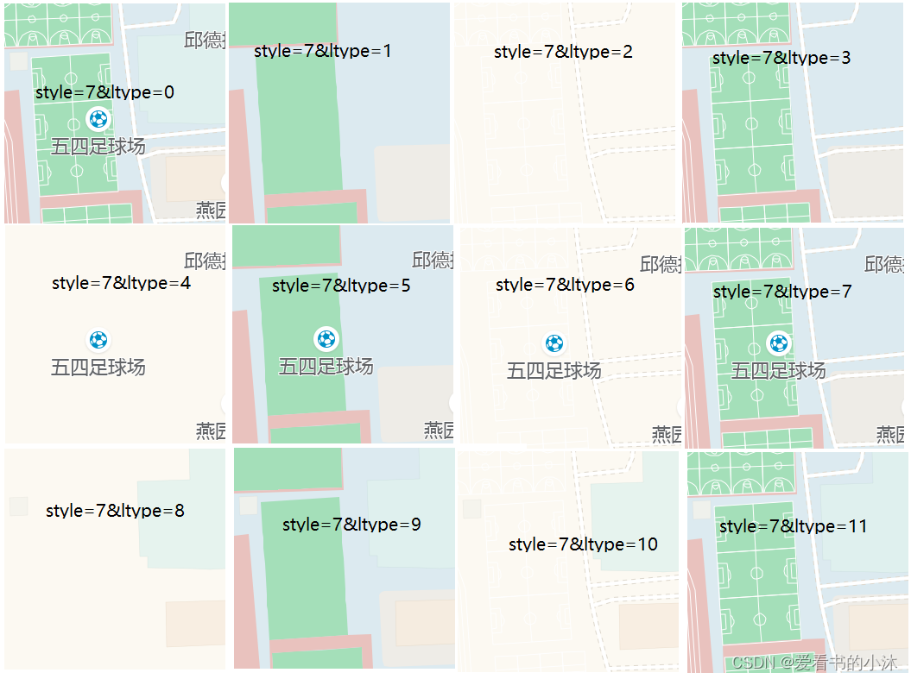

### 2.8 百度地图

```
http://p2.go2map.com/seamless1/0/174/717/3/1/744_212.png
```

### 2.9 搜狗地图

```
http://p2.go2map.com/seamless1/0/174/717/3/1/744_212.png
```

### 2.10 腾讯地图

[显示边界信息：可以查看区域的经纬度的范围。](https://lbs.qq.com/webDemoCenter/javascriptV2/mapOperate/mapBoundSize)
[叠加自定义网格：可以查看区域的瓦片的坐标。](https://lbs.qq.com/webDemoCenter/javascriptV2/mapType/mapOverlayMapType)
[限定最大最小缩放级别：查看当前地图的缩放级别](https://lbs.qq.com/webDemoCenter/javascriptV2/mapOperate/mapMax)

腾讯地图瓦片的坐标原点在左下角【-85.05112877980659,-180】
Google 地图瓦片的坐标原点在左上角【85.05112877980659,-180】
腾讯地图瓦片与Google的地图瓦片切割方法相同，只不过腾讯地图瓦片完全遵循TMS标准，Google地图瓦片则是TMS的一种变种。
地图投影坐标系均采用Web Mercator投影，地图瓦片分辨率也完全一致。
腾讯瓦片的最小缩放级别为4级（经过本人测试是3级）。

```
### roadmap:普通街道；satellite:卫星地图；hybrid:卫星地图(路网)
http://rt0.map.gtimg.com/realtimerender?z={z}&x={x}&y={-y}&type=vector&style=0
https://rt1.map.gtimg.com/tile?z=3&x=7&y=5&styleid=1&version=117
```

OpenLayers6:

```
new ol.layer.Tile({
    source: new ol.source.XYZ({
        url: "http://rt{0-3}.map.gtimg.com/realtimerender?z={z}&x={x}&y={-y}&type=vector&style=0"
    })
}),
```

### 2.11 天地图

[https://www.tianditu.gov.cn/](https://www.tianditu.gov.cn/)
[http://lbs.tianditu.gov.cn/server/MapService.html](http://lbs.tianditu.gov.cn/server/MapService.html)

```
http://t0.tianditu.gov.cn/img_w/wmts?SERVICE=WMTS&REQUEST=GetTile&VERSION=1.0.0&LAYER=img&STYLE=default&TILEMATRIXSET=w&FORMAT=tiles&TILEMATRIX=18&TILEROW=99247&TILECOL=215766&tk=您的密钥
https://t0.tianditu.gov.cn/DataServer?T=cia_w&x=16&y=24&l=6&tk=您的密钥
```

## 3、ol.source.Tile

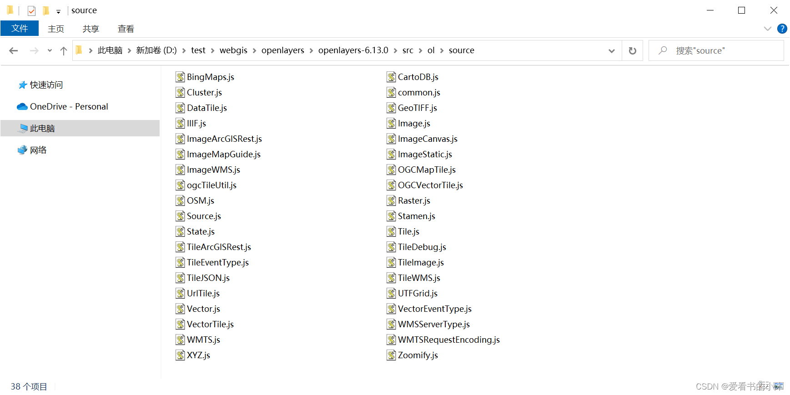

[https://openlayers.org/en/latest/apidoc/module-ol_source.html](https://openlayers.org/en/latest/apidoc/module-ol_source.html)

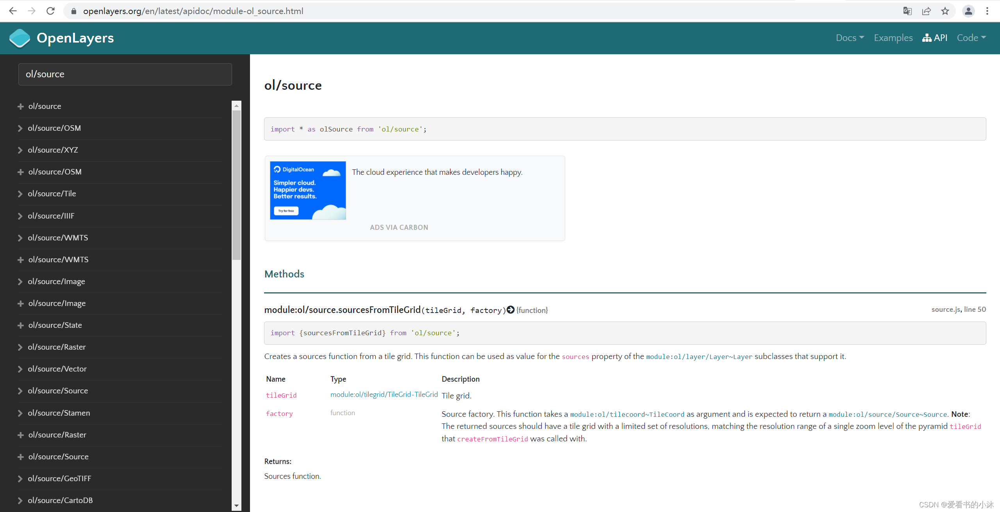

原文:[爱看书的小沐:【GIS开发】OpenLayers在线瓦片数据源汇总](https://blog.csdn.net/hhy321/article/details/123490804)