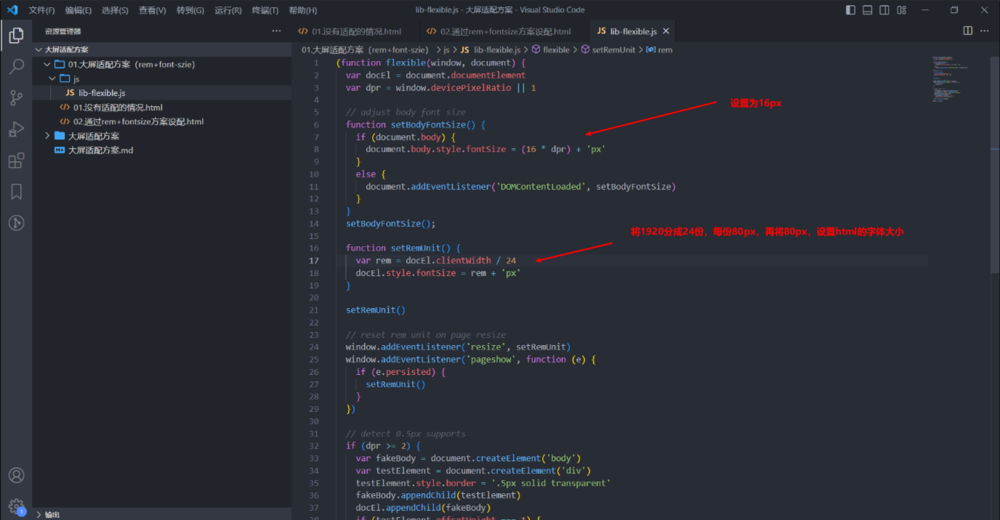
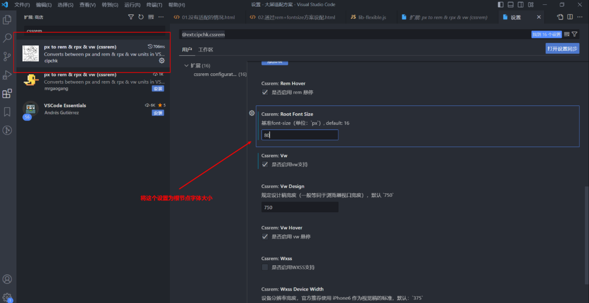
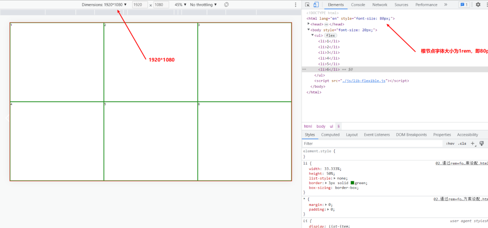
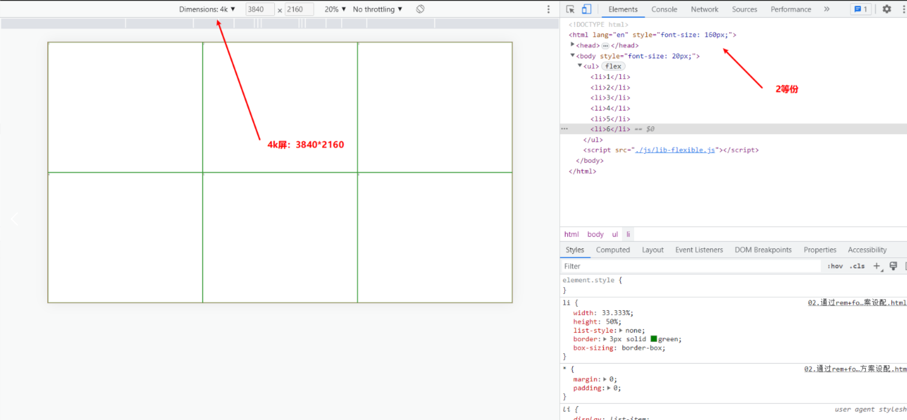
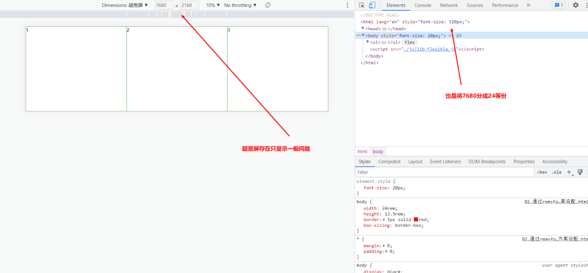
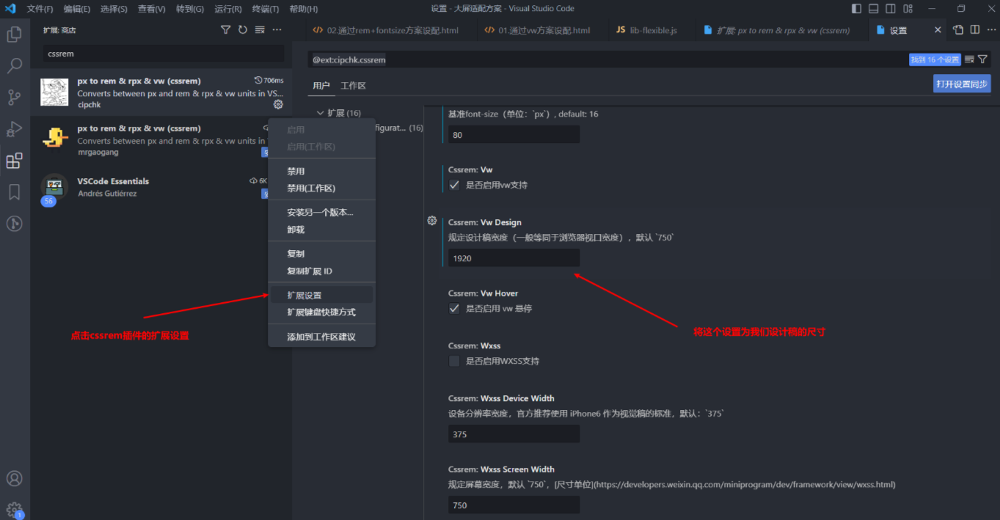
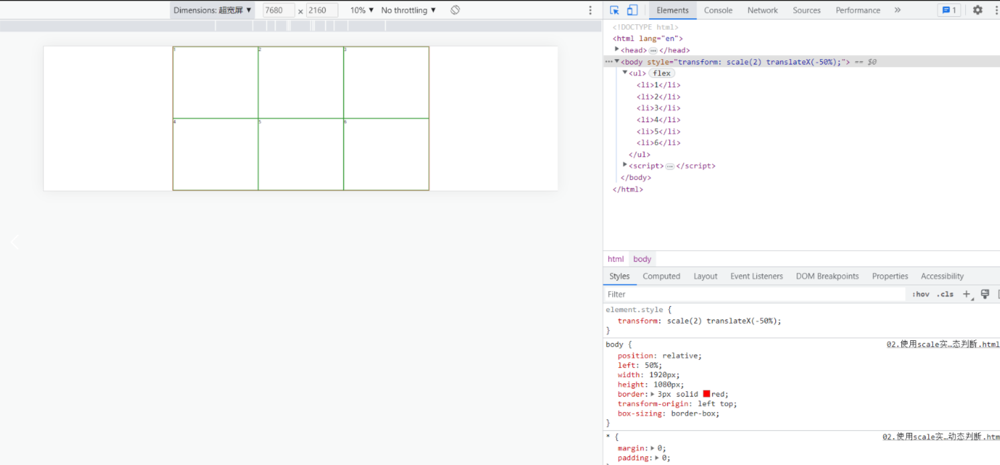

# 前端大屏适配几种方案

## 一、方案一：rem+font-size

动态设置HTML根字体大小和body字体大小，会使用到lib-flexible.js插件

lib-flexible.js

```xml
(function flexible(window, document) {
  var docEl = document.documentElement
  var dpr = window.devicePixelRatio || 1
 
  // adjust body font size
  function setBodyFontSize() {
    if (document.body) {
      document.body.style.fontSize = (16 * dpr) + 'px'
    }
    else {
      document.addEventListener('DOMContentLoaded', setBodyFontSize)
    }
  }
  setBodyFontSize();
 
  function setRemUnit() {
    var rem = docEl.clientWidth / 24
    docEl.style.fontSize = rem + 'px'
  }
 
  setRemUnit()
 
  // reset rem unit on page resize
  window.addEventListener('resize', setRemUnit)
  window.addEventListener('pageshow', function (e) {
    if (e.persisted) {
      setRemUnit()
    }
  })
 
  // detect 0.5px supports
  if (dpr >= 2) {
    var fakeBody = document.createElement('body')
    var testElement = document.createElement('div')
    testElement.style.border = '.5px solid transparent'
    fakeBody.appendChild(testElement)
    docEl.appendChild(fakeBody)
    if (testElement.offsetHeight === 1) {
      docEl.classList.add('hairlines')
    }
    docEl.removeChild(fakeBody)
  }
}(window, document))
```

我们可以将它下载下来。打开js文件，将设计稿的宽度（1920px）平均分成24等份，每一份为80px。将这个值设置为html字体大小，既1rem = 80px； 24rem = 1920px。

tips：rem是根据html字体大小来计算的，假如html字体为16px，则1rem就等于16px；



在移动端通常会分成10份，PC端分成24份。

安装cssrem插件，根节点的字体大小设置为80px。这个是px单位转rem的参考值。


配置插件的基准值：



这样的话放我们在书写px的适合，这个插件就会自动帮我们转化成rem。

```xml

<!DOCTYPE html>
<html lang="en">
  <head>
    <meta charset="UTF-8" />
    <meta http-equiv="X-UA-Compatible" content="IE=edge" />
    <meta name="viewport" content="width=device-width, initial-scale=1.0" />
    <title>Document</title>
    <style>
      * {
        margin: 0;
        padding: 0;
      }
      body {
        width: 24rem;
        height: 13.5rem;
        border: 3px solid red;
        box-sizing: border-box;
      }
      ul {
        display: flex;
        flex-direction: row;
        flex-wrap: wrap;
        width: 100%;
        height: 100%;
      }
 
      li {
        width: 33.333%;
        height: 50%;
        font-size: 0.375rem;
        list-style: none;
        border: 3px solid green;
        box-sizing: border-box;
      }
    </style>
  </head>
  <body>
    <ul>
      <li>1</li>
      <li>2</li>
      <li>3</li>
      <li>4</li>
      <li>5</li>
      <li>6</li>
    </ul>
  </body>
  <script src="./js/lib-flexible.js"></script>
</html>

```

### 1.查看适配情况

#### 1.1 1920*1080情况下



#### 1.2 3840*2160(4k屏)情况下

3840也是分成24等份：3840 / 24 = 160



#### 1.3 7680*2160 超宽屏下

超宽屏情况下只显示了上半部分，这种适配方式比较适合16：9的情况下使用，后面会有其他方案解决这个问题。



## 二、方案二：vw（单位）

直接使用vw单位，屏幕宽度默认为100vw，那么100vw = 1920px；1vw = 19.2px。这个也是使用cssrem插件，直接将body的宽高（1920px * 1080px），将px转成vw单位。



这种方案和第一个方案类似，超宽屏的情况下也是不能全部显示

```xml

<!DOCTYPE html>
<html lang="en">
  <head>
    <meta charset="UTF-8" />
    <meta http-equiv="X-UA-Compatible" content="IE=edge" />
    <meta name="viewport" content="width=device-width, initial-scale=1.0" />
    <title>Document</title>
    <style>
      * {
        margin: 0;
        padding: 0;
      }
      body {
        width: 100vw;
        height: 56.25vw;
        border: 3px solid red;
        box-sizing: border-box;
      }
      ul {
        display: flex;
        flex-direction: row;
        flex-wrap: wrap;
        width: 100%;
        height: 100%;
      }
 
      li {
        width: 33.333%;
        height: 50%;
        font-size: 1.5625vw;
        list-style: none;
        border: 3px solid green;
        box-sizing: border-box;
      }
    </style>
  </head>
  <body>
    <ul>
      <li>1</li>
      <li>2</li>
      <li>3</li>
      <li>4</li>
      <li>5</li>
      <li>6</li>
    </ul>
  </body>
</html>

```

## 三、方案三：scale（缩放）

很多的大屏适配都是使用的这种方案。这种方案的原理就是根据宽高比例进行缩放。

### 1. 根据宽度比率进行缩放

（宽度比率=网页当前宽度/设计稿宽度）

```xml

<script>
    // 设计稿：1920 * 1080
    // 1.设计稿尺寸
    let targetWidth = 1920;
    // 2.拿到当前设备（浏览器）的宽度
    // document.documentElement  获取html的宽度
    let currentWidth =
      document.documentElement.clientWidth || document.body.clientWidth;
    // 3.计算缩放比率(屏幕过宽，根据高度计算缩放比例)
    let scaleRatio = currentWidth / targetWidth; 
    // 4.开始缩放网页
    document.body.style = `transform: scale(${scaleRatio})`;
  </script>

```

上面这种根据宽度比例进行缩放的，针对1920 * 1080,3840 * 2160(4k)是没有问题的，但是在超宽屏的情况下还是存在只显示一半的问题。

分析原因：

```xml

我们的设计稿：
1920 * 1080 => 要适配 (1920*2=3840, 1080*2=2160, 4k屏) 3840 * 2160
也要适配=> ( 1920*4 = 7680 : 1080 * 2 = 2160) 7680 * 2160 
 
我们当前是根据宽度比率进行缩放的：
 
先设配3840 * 2160
 
scaleRatio = 3840 / 1920  = 2
 
根据这个缩放比率
 
我们的设计稿宽高都会被缩放两倍
 
1920 * 2 = 3840
 
1080 * 2 = 2160
 
 
 
设配7680 * 2160
 
scaleRatio = 7680 / 1920  =  4
 
根据这个宽度比例我们的设置稿宽高都会被缩放4倍
 
1920 * 4 = 7680
 
1080 * 4  = 4240 
这个原先的比例是 4 : 2,现在变成了 4 ：4 ，这也是为什么我们只看到一半高度的原因。 

```

### 2. 动态计算

动态计算网页宽高比，决定是按照宽度的比例还是高度的比例进行缩放。

```xml

  <script>
    // 设计稿：1920 * 1080
    // 1.设计稿尺寸
    let targetWidth = 1920;
    let targetHeight = 1080;
 
    let targetRatio = 16 / 9; // 宽高比率 （宽 / 高）
 
    // 2.拿到当前设备（浏览器）的宽度和高度
    let currentWidth =
      document.documentElement.clientWidth || document.body.clientWidth;
 
    let currentHeight =
      document.documentElement.clientHeight || document.body.clientHeight;
 
    // 3.计算缩放比率(屏幕过宽，根据高度计算缩放比例)
		// 若currentWidth是4k屏宽度 3840 除于 我们设计稿的宽度 1920  3840/1920 = 2
		// 这样页面就行进行2倍缩放
    let scaleRatio = currentWidth / targetWidth; // 参照宽度进行缩放（默认情况下）
		
    // 当前页面宽高比例，当页面越宽currentRatio值就越大
    let currentRatio = currentWidth / currentHeight;
		
		// 判断是根据宽度进行缩放，还是根据高度进行缩放
    if (currentRatio > targetRatio) {
      // 根据高度进行网页的缩放
      scaleRatio = currentHeight / targetHeight; // 参照高度进行缩放（屏幕很宽的情况下）
      document.body.style = `transform: scale(${scaleRatio}) translateX(-50%)`;
    } else {
      // 根据宽度进行网页的缩放
      document.body.style = `transform: scale(${scaleRatio})`;
    }
  </script>

```

#### 2.1 超宽屏最终适配效果



完整demo代码：

```xml

<!DOCTYPE html>
<html lang="en">
  <head>
    <meta charset="UTF-8" />
    <meta http-equiv="X-UA-Compatible" content="IE=edge" />
    <meta name="viewport" content="width=device-width, initial-scale=1.0" />
    <title>Document</title>
    <style>
      * {
        margin: 0;
        padding: 0;
      }
      body {
        position: relative;
        width: 1920px;
        height: 1080px;
        border: 3px solid red;
        /* 设置缩放原点 */
        transform-origin: left top;
        box-sizing: border-box;
      }
      ul {
        display: flex;
        flex-direction: row;
        flex-wrap: wrap;
        width: 100%;
        height: 100%;
      }
 
      li {
        width: 33.333%;
        height: 50%;
        font-size: 30px;
        list-style: none;
        border: 3px solid green;
        box-sizing: border-box;
      }
    </style>
  </head>
  <body>
    <ul>
      <li>1</li>
      <li>2</li>
      <li>3</li>
      <li>4</li>
      <li>5</li>
      <li>6</li>
    </ul>
  </body>
  <script>
    // 设计稿：1920 * 1080
    // 设配目标：1920 * 1080 ( 1 : 1) | 3840* 2160 ( 2 : 2 ) | 7680 * 2160 ( 4 : 2)
 
    // 1.设计稿尺寸
    let targetWidth = 1920;
    let targetHeight = 1080;
 
    let targetRatio = 16 / 9; // 宽高比率 （宽 / 高）
 
    // 2.拿到当前设备（浏览器）的宽度
    let currentWidth =
      document.documentElement.clientWidth || document.body.clientWidth;
    let currentHeight =
      document.documentElement.clientHeight || document.body.clientHeight;
    // 3.计算缩放比率(屏幕过宽，根据高度计算缩放比例)
    let scaleRatio = currentWidth / targetWidth; // 参照宽度进行缩放（默认情况下）
 
    // 当前宽高比例
    let currentRatio = currentWidth / currentHeight;
 
    if (currentRatio > targetRatio) {
      scaleRatio = currentHeight / targetHeight; // 参照高度进行缩放（屏幕很宽的情况下）
      document.body.style = `transform: scale(${scaleRatio}) translateX(-50%); left: 50%;`;
    } else {
      // 4.开始缩放网页
      document.body.style = `transform: scale(${scaleRatio})`;
    }
  </script>
</html>

```

js

```xml

		<script>
			var lazyFun;
		    function init(el, width, height) {
		        var _el = document.getElementById(el);
		        var hScale = window.innerHeight / height;
		        var wScale = window.innerWidth / width;
		        _el.style.transform = 'scale(' + wScale + ',' + hScale + ')'
		    }
		    init('mainbody', 1920, 1080);
		    window.onresize = function() {
		        clearTimeout(lazyFun);
		        lazyFun = setTimeout(function() {
		            init('mainbody', 1920, 1080)
		        }, 100);
		    };
		</script>

```

## 四、在vue中使用

```参考视频：```
<video controls src="./videos/large-screen-01.mp4"></video>

### 1. 设置缩放比例函数rem.js

```xml

// 基准大小 -- 设计稿：1920 * 1080
const baseWidth = 1920;
const baseHeight = 1080;

// 设置 rem 函数
function setRem() {
    // 4.开始缩放网页
    document.body.style = `transform: scale(${getScale()})`;
}

// 获取缩放比例
const getScale = () => {
    // 当前设备（浏览器）的宽高
    let currentWidth =
        document.documentElement.clientWidth || document.body.clientWidth;
    let currentHeight =
        document.documentElement.clientHeight || document.body.clientHeight;
    // 计算缩放比率(屏幕过宽，根据高度计算缩放比例)
    const scaleX = currentWidth / baseWidth;
    const scaleY = currentHeight / baseHeight;
    let scaleRatio = Math.min(scaleX, scaleY);
    return scaleRatio;
}

// 计算内容距离顶部和左侧距离，使其一直处于居中状态
const getDistance = () => {
    // 当前设备（浏览器）的宽高
    let currentWidth =
        document.documentElement.clientWidth || document.body.clientWidth;
    let currentHeight =
        document.documentElement.clientHeight || document.body.clientHeight;
    let scaleRatio = getScale();

    let left = (currentWidth - baseWidth * scaleRatio) / 2;
    let top = (currentHeight - baseHeight * scaleRatio) / 2;
    return { left, top }
}

// 设置 rem 函数
export default {
    setRem,
    getScale,
    getDistance
};

```

### 2. App/body全局样式

```xml

<template>
  <HelloWorld />
</template>

<script setup>
import HelloWorld from "./components/HelloWorld.vue";
</script>

<style>
* {
  margin: 0;
  padding: 0;
}
html,
body,
#app {
  margin: 0;
  padding: 0;
  width: 100%;
  height: 100%;
  font-family: Helvetica Neue, Helvetica, PingFang SC, Hiragino Sans GB,
    Microsoft YaHei, SimSun, sans-serif;
  font-weight: 400;
  -webkit-font-smoothing: antialiased;
  -webkit-tap-highlight-color: transparent;
  background-color: #fff;
  font-size: 14px;
  overflow: hidden;
  position: relative;
}
</style>

```

### 3. 组件内使用rem.js导出的函数计算容器缩放比例和居中距离

```xml

<template>
  <div class="main-wapper">
    <div id="main-container" class="main-container">
      <ul>
        <li>1</li>
        <li>2</li>
        <li>3</li>
        <li>4</li>
        <li>5</li>
        <li>6</li>
      </ul>
    </div>
  </div>
</template>

<script setup>
import rem from "@/utils/rem";
import { onMounted } from "vue";

onMounted(() => {
  init();
});

const init = () => {
  // 初始化
  initWindows();
  // 改变窗口时重新设置rem
  window.addEventListener(
    "resize",
    () => {
      initWindows();
    },
    true
  );
};
const initWindows = () => {
  const scaleRatio = rem.getScale();
  const distance = rem.getDistance();
  document.getElementById(
    "main-container"
  ).style.transform = `translate(${distance.left}px,${distance.top}px) scale(${scaleRatio})`;
};
</script>

<style>
.main-wapper {
  width: 100%;
  height: 100%;
  /* background: url("@/assets/images/bg.jpg") no-repeat center center; */
  background-color: #fff;
  background-size: 100% 100%;
  background-size: cover;
}
.main-container {
  width: 1920px;
  height: 1080px;
  display: flex;
  flex-direction: column;

  position: fixed;
  top: 0px;
  left: 0px;
  overflow: hidden;
  transform-origin: left top;
}
ul {
  display: grid;
  grid-template-columns: repeat(3, 1fr); /* 每行 3 个 li */
  width: 100%;
  height: 100%;
  border: 3px solid rgb(38, 0, 255);
  box-sizing: border-box;
  gap: 10px; /* 添加 10px 的间隔 */
  padding: 10px;
}

li {
  font-size: 30px;
  list-style: none;
  border: 2px solid red;
  box-sizing: border-box;
}
</style>

```