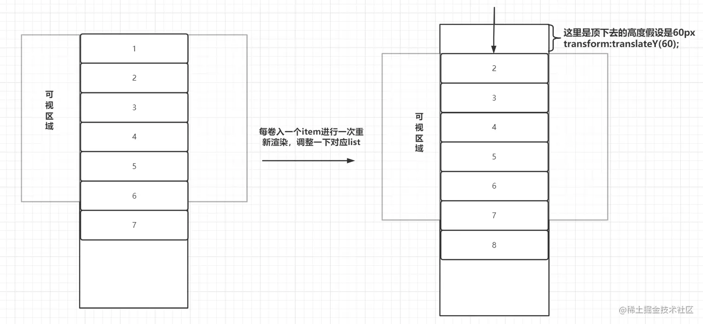
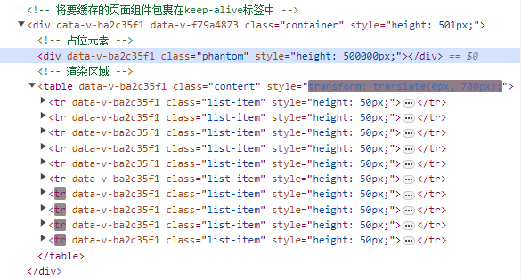

# 写写虚拟滚动的示例


## 一、虚拟滚动

虚拟滚动(虚拟列表)，是一种技术实现方案。针对需要展示大数据量的表格进行渲染优化。假设有10w数据需要展示在页面上，一次性全部进行展示显然会让页面直接卡爆。

可能会有很多种方式解决：`分页，懒加载，时间分片`都可来进行优化渲染，但是他们各有各的不足之处

**分页**：简单粗暴，每次只展示固定数量，想要浏览更多，只能切换到下一页

**懒加载**：此场景下可以假设是触底加载更多。页面初次仅展示20条，触底时再新增一些数据进行渲染。(随着触发次数的增加，列表元素的DOM也在增加，最终也会造成页面卡顿)

**时间分片**：与懒加载略有不同，规定每次页面每次渲染一定个数，渲染完毕之后再渲染下一批，直到全部完成渲染。(弊端与懒加载类似，并且每次页面渲染都可能会造成闪动)

> **以上方案共有的问题**
>
> `懒加载、时间分片`都不可避免地可能在列表中渲染了大量的DOM，如果每一列表项都是简单的渲染还好，但凡每一项内容量复杂，都会造成性能问题。

虚拟列表就很好地回避了这个问题，通过计算每次仅仅渲染可视区域的内容。



## 二、简单示例(Vue3)

```xml
<template>
  <div class="container" :style="{ height: `${virtualList.listHeight}px` }">
    <!-- 占位元素 -->
    <div class="phantom" :style="{ height: totalHeight + 'px' }"></div>
    <!-- 渲染区域 -->
    <table
      class="content"
      :style="{ transform: `translate(0, ${virtualList.currentOffset}px)` }"
    >
      <tr
        v-for="item in showData"
        :key="item.id"
        :style="{ height: `${virtualList.itemHeight}px` }"
        class="list-item"
      >
        <td>
          {{ item.value }}
        </td>
      </tr>
    </table>
  </div>
</template>

<script setup>
import { ref, reactive, onMounted, computed } from "vue";

const data = ref([]);
const virtualList = reactive({
  itemHeight: 50, // 每一项高度, 固定高度
  listHeight: 501, // 表格总高度,自定义
  currentOffset: 0, // 偏移量
  start: 0, // 起始
  end: 10, // 结束
  count: 10, // 行数
});

onMounted(() => {
  // 获取数据
  data.value = mockData();
  // 初始化虚拟列表
  init();
});

const init = () => {
  const containerDom = document.querySelector(".container");
  virtualList.end = virtualList.start + virtualList.count;
  containerDom && containerDom.addEventListener("scroll", handleScroll);
};

// 总数据所占据的高度
const totalHeight = computed(() => data.value.length * virtualList.itemHeight);
// 动态展示的数据
const showData = computed(() =>
  data.value.slice(virtualList.start, virtualList.end)
);
// 随着滚动动态计算start、end、currentOffset
const handleScroll = (e) => {
  const scrollTop = e.target.scrollTop;
  virtualList.start = Math.ceil(scrollTop / virtualList.itemHeight);
  virtualList.end = virtualList.start + virtualList.count;
  virtualList.currentOffset = scrollTop - (scrollTop % virtualList.itemHeight);
};
// 模拟数据
const mockData = (count = 10000) => {
  let dataList = [];
  for (let i = 1; i <= count; i++) {
    dataList.push({ id: i, value: "字符内容" + i });
  }
  return dataList;
};
</script>

<style scoped>
.container {
  position: relative;
  overflow-y: auto;
}
.content {
  position: absolute;
  top: 0;
  right: 0;
  left: 0;
  text-align: center;
  width: 100%;
}
.list-item {
  border: 1px solid #999;
}
</style>
```

以上代码实现了一个固定宽度的虚拟列表：

- 利用`phantom`撑起实际渲染所有数据的高度，`content`仅渲染可视区域内容`count`条数据
- 通过scroll事件不断计算`content`的位置以及对应位置应当展示的数据
  - 1、scrollTop来确定开启了绝对定位的content的向下偏移量，确保它始终在视口
  - 2、偏移量/每一项高度 = 开始位置start，计算得end。于是得出content应该展示什么数据



每一次的滚动，`showData`的值在不断地变化，从DOM结构上我们看到不论怎样滚动都只渲染10条数据。所以，无论数据量多少，都不会对其渲染性能产生什么影响

<br/>
原文链接：<a href="https://juejin.cn/post/7293804880707469350" target="_blank" rel="noreferrer">跳转掘金</a>