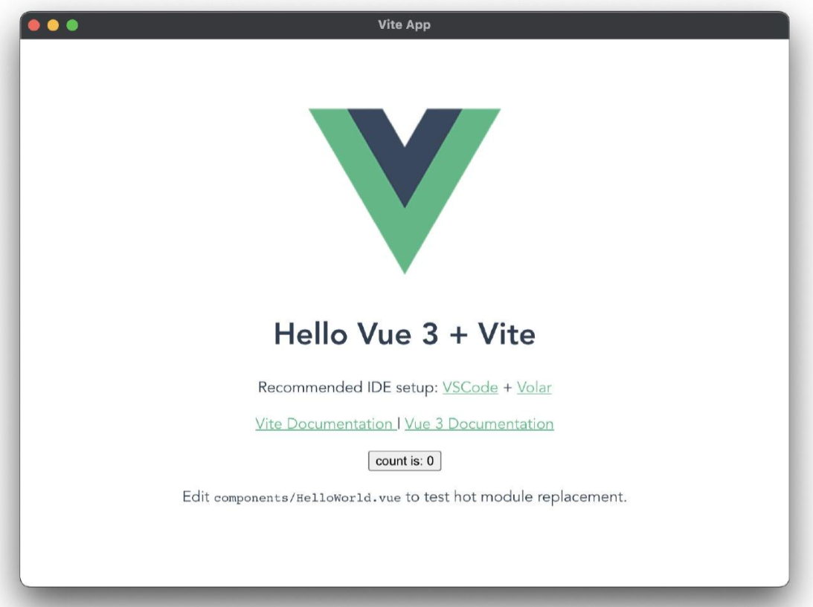

# Vite+Vue3+Electron 快速构建一个桌面应用（一）

## 一. 创建一个Vite项目

### 1. 安装 vite

``` PowerShell
yarn create vite
```
### 2. 创建项目
创建命令如下：

``` PowerShell
yarn create vite <your-vue-app-name> --template vue
```
此处创建一个项目，名为kuari。

``` PowerShell
yarn create vite kuari --template vue
```
### 3. 进入且运行
进入项目，在运行前需要先安装下依赖。

``` PowerShell
cd kuari
yarn install
yarn dev
```
在运行命令敲下的一瞬间，几乎是已经在运行了，不愧是vite。此时按照输出，打开地址预览，即可看到初始化页面。至此一个基础的vite项目创建完成。


## 二. 配置Electron

### 1. 官方文档
在Electron官网的快速入门文档中，有官方给出的利用html、javascript、css来创建一个electron应用的案例，vite+electron的方案也借鉴其中。

### 2. 安装
首先安装electron至vite应用。目前electron的版本为^15.1.2,。

``` PowerShell
yarn add --dev electron
```
### 3. 配置文件

#### 1）vite.config.js

``` Javascript
import { defineConfig } from 'vite'
import vue from '@vitejs/plugin-vue'
import path from 'path' 										// 新增

// https://vitejs.dev/config/
export default defineConfig({
  base: path.resolve(__dirname, './dist/'),	// 新增
  plugins: [vue()]
})
```

#### 2）main.js
创建一个新的文件main.js，需要注意的是，该内容中index.html的加载路径跟electron官网给的配置不同。

``` Javascript
// main.js

// 控制应用生命周期和创建原生浏览器窗口的模组
const { app, BrowserWindow } = require('electron')
const path = require('path')

function createWindow () {
  // 创建浏览器窗口
  const mainWindow = new BrowserWindow({
    width: 800,
    height: 600,
    webPreferences: {
      preload: path.join(__dirname, 'preload.js')
    }
  })

  // 加载 index.html
  mainWindow.loadFile('dist/index.html') // 此处跟electron官网路径不同，需要注意

  // 打开开发工具
  // mainWindow.webContents.openDevTools()
}

// 这段程序将会在 Electron 结束初始化
// 和创建浏览器窗口的时候调用
// 部分 API 在 ready 事件触发后才能使用。
app.whenReady().then(() => {
  createWindow()

  app.on('activate', function () {
    // 通常在 macOS 上，当点击 dock 中的应用程序图标时，如果没有其他
    // 打开的窗口，那么程序会重新创建一个窗口。
    if (BrowserWindow.getAllWindows().length === 0) createWindow()
  })
})

// 除了 macOS 外，当所有窗口都被关闭的时候退出程序。 因此，通常对程序和它们在
// 任务栏上的图标来说，应当保持活跃状态，直到用户使用 Cmd + Q 退出。
app.on('window-all-closed', function () {
  if (process.platform !== 'darwin') app.quit()
})

// 在这个文件中，你可以包含应用程序剩余的所有部分的代码，
// 也可以拆分成几个文件，然后用 require 导入。
```

#### 3）preload.js
创建一个新的文件preload.js。

``` Javascript
// preload.js

// 所有Node.js API都可以在预加载过程中使用。
// 它拥有与Chrome扩展一样的沙盒。
window.addEventListener('DOMContentLoaded', () => {
  const replaceText = (selector, text) => {
    const element = document.getElementById(selector)
    if (element) element.innerText = text
  }

  for (const dependency of ['chrome', 'node', 'electron']) {
    replaceText(`${dependency}-version`, process.versions[dependency])
  }
})
```

#### 4）package.json
为了确保能够运行相关electron的命令，需要修改package.json文件。

首先需要去设置main属性，electron默认会去在开始时寻找项目根目录下的index.js文件，此处我们使用的是main.js，所以需要去定义下。

``` Javascript
// package.json

{
  "name": "kuari",
  "version": "0.0.0",
  "main": "main.js", 			// 新增
  "scripts": {
    "dev": "vite",
    "build": "vite build",
    "serve": "vite preview"
  },
  "dependencies": {
    "vue": "^3.2.16"
  },
  "devDependencies": {
    "@vitejs/plugin-vue": "^1.9.3",
    "electron": "^15.1.2",
    "vite": "^2.6.4"
  }
}
```

最后我们需要新增electron的运行命令。

``` Javascript
// package.json

{
  "name": "kuari",
  "version": "0.0.0",
  "main": "main.js",
  "scripts": {
    "dev": "vite",
    "build": "vite build",
    "serve": "vite preview",
    "electron:serve": "electron ." // 新增
  },
  "dependencies": {
    "vue": "^3.2.16"
  },
  "devDependencies": {
    "@vitejs/plugin-vue": "^1.9.3",
    "electron": "^15.1.2",
    "vite": "^2.6.4"
  }
}
```

## 三. 运行

直接在终端输入如下命令：

``` PowerShell
yarn electron:serve
```

接着我们就可以看到我们桌面应用就出来咯！

