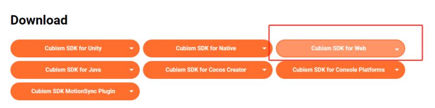
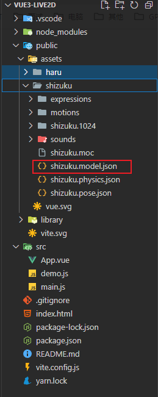

# 前端 Vue3+Live2d 开发虚拟人物应用

## 1. 所需技术栈

Vue3+ts
<br/>
Live2D官方SDK
<br/>
pixi.js@6.x  pixi-live2d-display 两个库

个人考虑到离线使用的情况，可以不安装依赖，直接引入本地的JS文件，参考：
https://github.com/1zBin/vue3-live2d.git

## 2. Live2D官方SDK

下载地址：https://www.live2d.com/en/sdk/about/  (需翻墙)

前端SDK需对应web选项



下载文件：


下载解压后将CubismSdkForWeb-4/Core/live2dcubismcore.min.js此文件复制到public/library文件夹中

并在index.html中引用

## 3. 引用两个库

```
npm install pixi.js@6.4.2
npm install pixi-live2d-display
```

## 4. 准备好live2d资源

一般设计师会给到一个文件夹，里面包含了一堆json，里面的.model3.json是live2d模型的入口文件。把这个文件夹放到项目的public目录，因为打包后它会出现在dist/下，到时候需要能够引用到。(ps:实在迷茫的小伙伴可以去B站买一个live2D有一分钱的)



## 5. 代码层面

在template标签中定义canvas标签

```
<template>
  <div>
    <canvas ref="canvas"></canvas>
  </div>
</template>
```

Script标签中引用vue方法和相应文件,定义变量
``` Typescript
<script setup lang="ts">
import { onBeforeUnmount, onMounted, ref } from "vue";
import * as PIXI from "pixi.js";
import { Live2DModel } from "pixi-live2d-display/cubism4";

(window as any).PIXI = PIXI;
let app:PIXI.Application;
let model:any;
const canvas = ref(null);
......

```

获取live2d模型调用PIXI.js在页面进行渲染，我这里加了按住模型拖拽功能，可用可不用。

``` Typescript
const live2d = PIXI.live2d;

onMounted(async () => {
  app = new PIXI.Application({
    view: canvas.value,
    // height: 500,
    // width: 500,
    autoDensity: true,
    antialias: true,
    resolution: window.devicePixelRatio,
    autoStart: true,
    resizeTo: window,
    transparent: true,
  });
  model = await live2d.Live2DModel.from("assets/shizuku/shizuku.model.json");

  app.stage.addChild(model);

  const scaleX = (innerWidth * 0.2) / model.width;
  const scaleY = (innerHeight * 0.4) / model.height;

  // fit the window
  model.scale.set(Math.min(scaleX, scaleY));

  model.x = innerWidth * 0.82;
  model.y = innerHeight * 0.6;

  draggable(model);
  addFrame(model);

  model.on("hit", (hitAreas) => {
    console.log("hitAreas", hitAreas);

    if (hitAreas.includes("body")) {
      model.motion("tap_body");
    }

    if (hitAreas.includes("head")) {
      model.expression();
    }
  });
});

function draggable(model) {
  model.buttonMode = true;
  model.on("pointerdown", (e) => {
    model.dragging = true;
    model._pointerX = e.data.global.x - model.x;
    model._pointerY = e.data.global.y - model.y;
  });
  model.on("pointermove", (e) => {
    if (model.dragging) {
      model.position.x = e.data.global.x - model._pointerX;
      model.position.y = e.data.global.y - model._pointerY;
    }
  });
  model.on("pointerupoutside", () => (model.dragging = false));
  model.on("pointerup", () => (model.dragging = false));
}

function addFrame(model) {
  const foreground = PIXI.Sprite.from(PIXI.Texture.WHITE);
  foreground.width = model.internalModel.width;
  foreground.height = model.internalModel.height;
  foreground.alpha = 0.2;

  model.addChild(foreground);
}

onBeforeUnmount(() => {
  model?.destroy();
  app?.destroy();
});
</script>
```

关于PIXI.js的方法可以参考相关博客：
https://www.cnblogs.com/huangqian/p/17626223.html

## 6. 启动项目

npm启动你的vue3项目就可以看到成果了


## 7. 进阶：Live2d模型动作&表情

Live2d模型动作&表情请看下一篇“vue3+live2d+electron 开发桌面宠物应用程式”