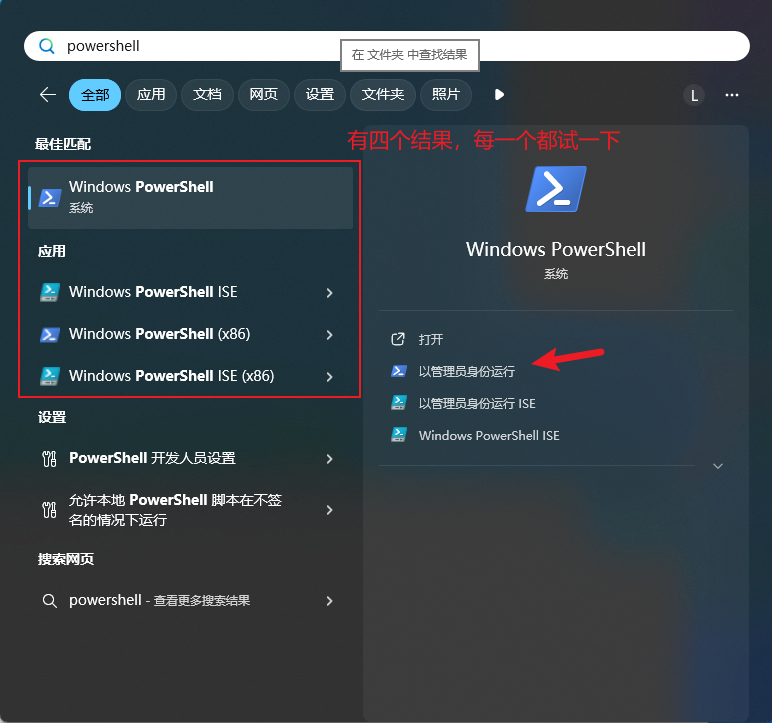
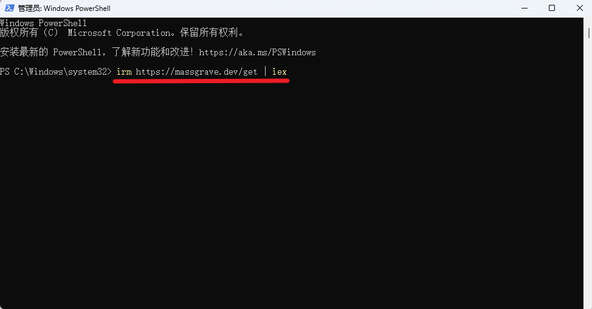
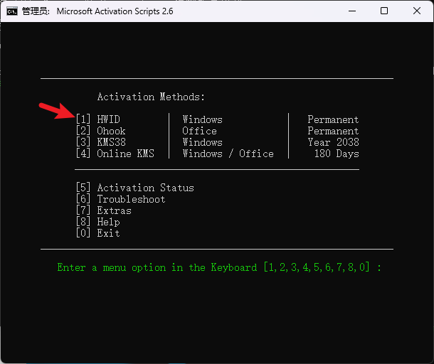
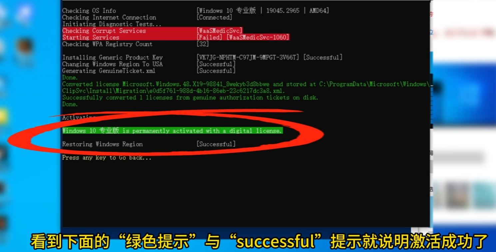

# 一键永久激活Windows系统

1. 首先确保电脑是正常联网，然后打开"win开始菜单"或者按 win + Q 搜索 PowerShell 

2. 然后点击以管理员来打开，打开之后输入激活代码：irm https://massgrave.dev/get | iex

3. 然后选择第一个，按数字键 1

4. 接下来就等待系统执行激活脚本就可以了

5. 看到下面的“绿色提示”和“successful”提示就说明激活成功了

6. 再打开系统设置，就会发现“未激活”提示消失了。